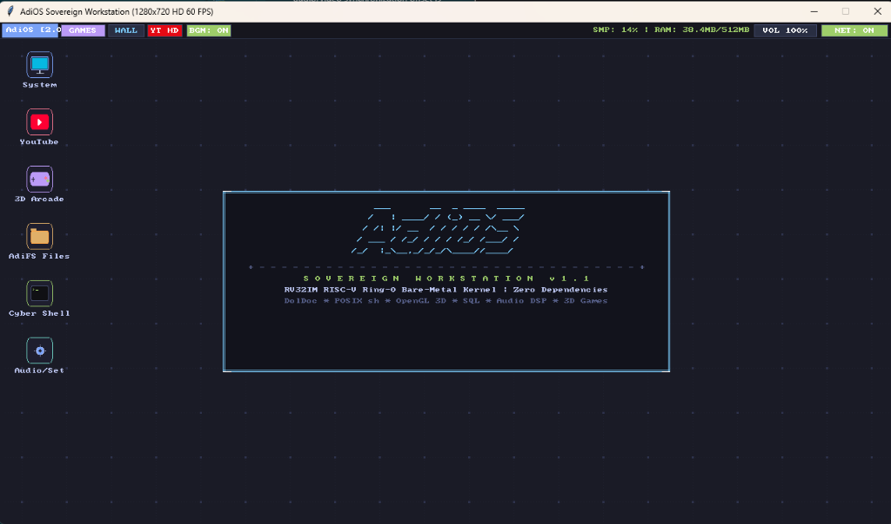

# AdiOS

> A custom 32-bit RISC-V operating system, desktop environment, and toolchain built from scratch.

AdiOS is an experimental, bare-metal operating system and simulation environment designed for the **RISC-V 32-bit (RV32IM)** architecture. Inspired by the simplicity and ring-0 freedom of retro operating systems like TempleOS, AdiOS is written from first principles with **zero external runtime dependencies**—just pure Python and bare-metal assembly.

It includes a full RV32IM CPU emulator, a 720p HD graphical desktop, a bare-metal terminal CLI, an in-house C99 compiler, a custom systems language (**AdiPython**), audio synthesizers, 3D games, and an integrated TCP/IP networking stack.

---

<div align="center">
  
  <p><em>AdiOS 720p HD desktop with window manager, terminal, file explorer, and system tray.</em></p>
</div>

---

## Highlights

- **Custom RV32IM Virtual Machine**: Cycle-accurate 32-bit RISC-V CPU core with fast instruction pre-decode cache, 512 MB RAM, and MMIO devices (UART, timer, disk, audio, and framebuffer).
- **Graphical Desktop (1280x720 @ 60 FPS)**: Custom 2D vector compositor with rounded windows, drop shadows, window management, desktop icons, and interactive taskbar flyouts (audio/volume, network).
- **Terminal & Shell Modes**:
  - **Bare-Metal CLI**: Direct assembly kernel running inside your terminal via UART console (`--cli`).
  - **Cyber Shell**: Interactive command shell with DolDoc hypertext, disk inspection, memory stats, and system diagnostics (`--shell`).
- **Complete Toolchains**:
  - **C99 Compiler**: Lexer, parser, RV32 code generator, and ELF32 binary emitter with a zero-dependency C standard library.
  - **AdiPython**: Custom systems language with AST compiler and native RV32IM JIT.
  - **RV32 Assembler & Disassembler**: Two-pass assembler for bare-metal kernels.
  - **Lisp Bytecode VM**: S-expression compiler and stack VM.
- **Audio & Media**:
  - Polyphonic tracker and synthesizer (Baroque chiptunes, PC speaker, ADSR envelopes, WAV export).
  - Synchronized media/YouTube player with live 32-band audio spectrum visualizer.
- **Networking & Storage**:
  - Full network stack: Ethernet II, ARP, IPv4, UDP, TCP Reno, HTTP/1.1, DNS, DHCP, and TLS 1.3.
  - Filesystems: Contiguous block storage (AdiFS), Ext2, and FAT32 drivers.
  - **SovereignSQL**: Lightweight relational database with B+ tree indexing and Write-Ahead Logging (WAL).
- **Built-in 3D Games**:
  - **CastleAdiOS**: 3D raycasting dungeon crawler.
  - **StarFlight**: 3D wireframe flight simulator with software rasterizer.

---

## Quick Start

### Prerequisites
- **Python 3.8+** (Windows, Linux, or macOS)
- *Optional*: `pygame` for GUI display, `yt-dlp` / `ffmpeg` for live YouTube streaming.

### Running AdiOS

#### 1. Graphical Desktop (Default)
```bash
python build.py
# or
python build.py --desktop
```
On Windows, you can also double-click `boot.bat`.

#### 2. Terminal CLI (Bare-Metal Assembly Kernel)
Run the headless assembly kernel directly in your terminal (no GUI window):
```bash
python build.py --cli
```

#### 3. Interactive Cyber Shell
Launch the interactive command shell prompt (`adios-cyber>`):
```bash
python build.py --shell
```

#### 4. Standalone 3D Games
```bash
# CastleAdiOS 3D Dungeon Crawler
python build.py --castle

# StarFlight 3D Flight Simulator
python build.py --3d
```

#### 5. Run Tests
```bash
# Run full automated regression suite
python build.py --test

# Run unit tests
python -m unittest discover -s tests -p "test_*.py"
```

---

## Command-Line Options

| Flag | Description |
|---|---|
| *(none)* | Assemble GUI kernel and launch the graphical desktop |
| `--desktop` | Launch desktop workstation (supports `--res WxH`, `--scale S`, `--ram MB`) |
| `--cli` | Assemble and boot bare-metal RV32 assembly CLI in the terminal |
| `--shell`, `--cyber` | Launch interactive Cyber Command Shell |
| `--castle`, `--fps` | Launch CastleAdiOS 3D raycasting dungeon crawler |
| `--3d`, `--flight` | Launch StarFlight 3D flight simulator |
| `--games`, `--arcade` | Launch 3D games arcade |
| `--youtube`, `--yt` | Launch desktop focused on YouTube player (`--yt-url <URL>`) |
| `--net` | Check host network adapter & bridge status |
| `--run <file.py>` | Execute an AdiPython script with the RV32IM runtime |
| `--hymn`, `--song` | Play synthesized Baroque hymn audio |
| `--bench` | Run system benchmarks |
| `--test` | Run 55-subsystem regression test suite |
| `--build` | Assemble `adios.bin` kernel without launching |
| `--help` | Show usage options |

---

## Desktop Controls & Shortcuts

| Action | Control |
|---|---|
| **Move Window** | Drag window titlebar |
| **Launch App** | Double-click desktop icon or click top taskbar menu |
| **Master Volume** | Click `[VOL]` on top taskbar to open slider & VU meter |
| **Network Status** | Click `[NET]` on top taskbar for network & airplane mode |
| **Background Music** | Click `[BGM: ON/OFF]` pill in the taskbar |
| **Play / Pause Media** | `Space` in YouTube Player |
| **Mute / Unmute** | `M` in YouTube Player |
| **Paste Media URL** | `Ctrl + V` or `[PASTE]` button |
| **Seek Media** | Click on progress / scrub bar |

---

## Project Structure

```text
adios/
├── build.py                # Main build, test, and launcher script
├── boot.bat                # Windows quick launcher
├── vm/                     # RV32IM CPU emulator, MMIO bus, display & VPU
├── kernel/                 # Bare-metal assembly kernels (GUI, CLI, scheduler)
├── desktop/                # Desktop environment, window manager, apps
├── graphics/               # 2D vector engine & 3D software rasterizer
├── userland/               # POSIX command shell & core utilities (cat, grep, ls)
├── holy/                   # Cyber shell, DolDoc engine, cosmic oracle
├── compiler/               # In-OS C99 compiler & ELF32 binary emitter
├── libc/                   # C standard library (stdio, stdlib, string, math)
├── adipython/              # AdiPython language runtime, AST, and JIT
├── audio/ & dsp/           # Sound server, polyphonic synthesizers & audio tracker
├── net/ & drivers/         # TCP/IP network stack, protocols, VirtIO & device drivers
├── fs/ & vfs/              # Filesystem drivers (AdiFS, Ext2, FAT32)
├── db/                     # Relational database engine with B+ tree and WAL
├── games/                  # 3D dungeon crawler & flight simulator
├── toolchain/              # RV32 assembler and disassembler
└── tests/                  # Automated subsystem regression test suites
```

---

## License

This project is open-source under the [MIT License](LICENSE).