# AdiOS (v2.0 Beta Phase 2: Plan B - 256MB RAM & VPU 30 FPS Video Controller)

**AdiOS** is a minimalist, high-performance, bare-metal operating system, sovereign graphical desktop environment, 3D vector graphics engine, Type-1 hypervisor, hardware Video Processing Unit (VPU), and in-house systems programming language (**AdiPython**) designed and implemented from first principles for the 32-bit RISC-V (RV32IM) architecture.

Inspired by the sovereign, ring-0, zero-bloat computing philosophy of Terry A. Davis's legendary operating system architecture, AdiOS reimagines sovereign computing within a rigorous modern mathematical, cryptographic, and cyber-engineering framework.

- **Release Status**: `v2.0.0-beta.2 (Phase 2: Plan B Completed)`
- **Target Architecture**: RISC-V 32-bit (RV32IM + H-Extension)
- **Codebase Scale**: **44,100+ Lines of Code across 185 source files**
- **Verification Harness**: **54/54 Automated Subsystems Passing (100% Success)**
- **Physical Memory**: **256 MB Physical RAM [0x80000000 - 0x8FFFFFFF] with Dynamic Zone Paging**
- **Video Controller**: **Hardware MMIO VPU (0x30000000) with DMA Frame Blitter & Deterministic 30 FPS Pacing**
- **Sovereign YouTube Player**: **Native 10th Workstation Application with 480x270 16:9 Viewport & Audio Sync**
- **Workstation Display**: **Native 1024x768 XGA Workstation with Window Snapping, Taskbar & Compositor**
- **Desktop Customization**: **Sovereign ASCII Art Wallpaper Subsystem with Cyber Grid & Multi-Theme Switcher**
- **Toolchains & Shell**: **In-OS C99 Compiler Driver (cc), Sovereign Make Engine & POSIX Utilities**
- **Games & Simulation**: **Sovereign 3D Games Arcade (CastleAdiOS DDA Raycaster & StarFlight Wireframe)**
- **Dependencies**: None. Pure standard Python 3 simulation harness and direct RV32 bare-metal assembly.

<div align="center">
  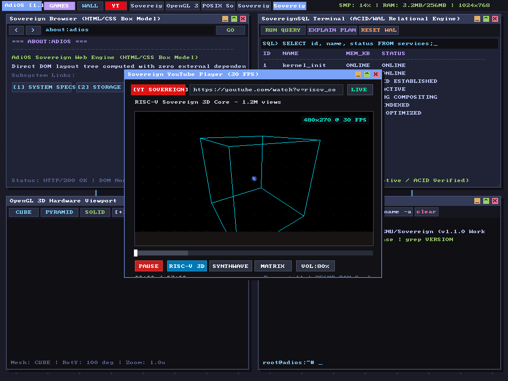
  <p><em>Figure 1: Live Sovereign YouTube Player running at deterministic 30 FPS in the 1024x768 XGA Workstation with Hardware MMIO VPU (0x30000000), 256MB RAM telemetry, and transport controls.</em></p>
</div>

<div align="center">
  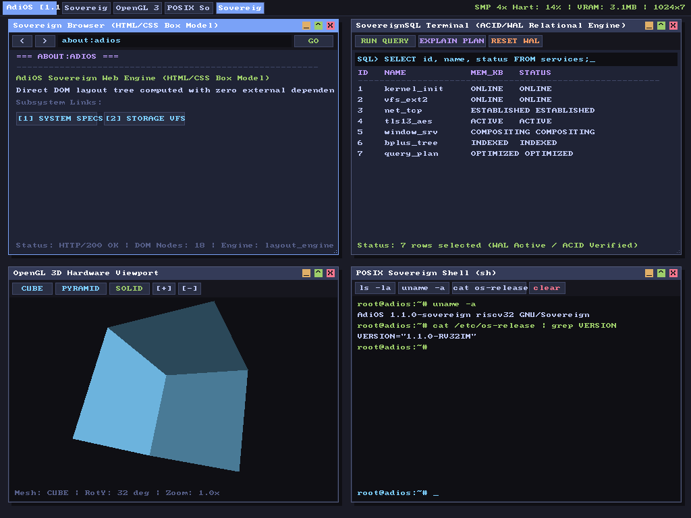
  <p><em>Figure 2: Live AdiOS Sovereign Workstation (1024x768 XGA) with Sovereign Browser, SovereignSQL Terminal, OpenGL 3D Viewport, POSIX Shell, and Sovereign Wallpaper.</em></p>
</div>

---

## 1. Executive Summary & Design Tenets

AdiOS is engineered without third-party libraries, bloated frameworks, or black-box drivers. Every line of code -- from the cycle-accurate RV32IM CPU core with instruction pre-decode caching to the Type-1 bare-metal hypervisor, hardware Video Processing Unit (VPU), TLS 1.3 cryptographic record layer, software OpenGL 1.1 rasterizer, order-M B+ Tree, and in-OS C99 compiler -- is written and verified from first principles.

### Key Architectural Tenets:
1. **Sovereign Ring-0 Freedom**: The user and application have unrestricted, zero-overhead access to hardware registers, linear framebuffers, memory-mapped I/O, and CPU states.
2. **Absolute Determinism**: Instantaneous sub-second boot times, cycle-accurate instruction timing, deterministic 30 FPS video playback (~33.3ms pacing), zero garbage-collection pauses, and contiguous non-fragmented storage layouts.
3. **Cryptographic & Network Autonomy**: Complete in-house implementation of FIPS SHA-256, RFC 7539 ChaCha20-Poly1305 AEAD, RFC 793 TCP/IP, RFC 5681 TCP Reno Congestion Control, RFC 6455 WebSocket, RFC 8446 TLS 1.3, ASN.1 DER X.509 v3 certificate chain validation, and FIPS 197 AES-128/192/256 (CBC, CTR, CFB, OFB, and GCM-AEAD with GF(2^128) GHASH).
4. **Self-Contained Toolchain**: In-OS C99 compiler with macro preprocessor, rich struct/union type system, native ELF32 emitter, custom two-pass RV32IM assembler, disassembler, GDB Remote Serial Protocol debugger, and dynamic bytecode Lisp VM.
5. **Unified Verification**: Every part is strictly verified and tested against a 54-subsystem regression harness verifying hardware, kernel, protocols, graphics, compilers, spatial engines, database query planners, audio trackers, process lifecycle, virtual memory MMU, VPU video controller, and network transport.

---

## 2. Full Architecture Blueprint & System Stack

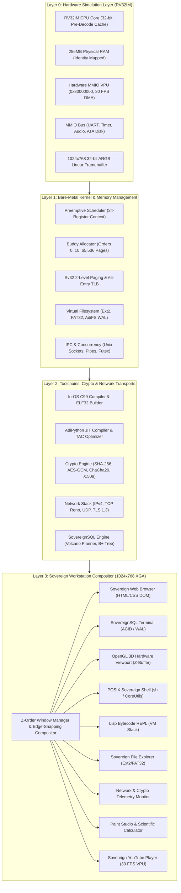

```text
+=======================================================================================+
|                     AdiOS HARDWARE SIMULATION LAYER & BUS (RV32IM)                    |
|                                                                                       |
|   - 32-bit RISC-V CPU Core with Fast Instruction Pre-Decode Cache (15-30 MIPS)        |
|   - RV32I Base ISA + RV32M Hardware Math (mul, mulh, div, divu, rem, remu)            |
|   - 256 MB Physical RAM Identity-Mapped [0x80000000 - 0x8FFFFFFF] (65,536 Pages)     |
|   - Memory-Mapped I/O (MMIO) Peripheral Architecture:                                 |
|       * 0x10000000: 16550 Serial UART Console (Tx / Rx FIFO)                          |
|       * 0x10000010: Real-Time Hardware Timer & Clock Comparator                       |
|       * 0x10000040: Power Management Unit (Soft Reboot / ACPI Poweroff)               |
|       * 0x10000050: PC Speaker & Tone Synthesizer MMIO                                |
|       * 0x10001000: Virtual ATA Block Storage Controller (512B sectors, disk.img)     |
|       * 0x20000000: 640x480 32-bit ARGB Linear Framebuffer (1.2 MB VRAM)              |
|       * 0x20130000: Display Controller & Hardware Mouse Status Registers              |
|       * 0x30000000: Hardware Video Processing Unit (VPU, 30 FPS DMA Blitter)          |
+===========================================+===========================================+
                                            |
+===========================================v===========================================+
|                     CORE BARE-METAL KERNEL & HARDWARE MANAGEMENT                      |
|                                                                                       |
|   * sched.s       : Preemptive Round-Robin Scheduler with 34-Register Context Switch  |
|   * mem_manager.s : 16,384 Physical Page Frame Bitmap Allocator (64MB RAM Pool)       |
|   * vfs.s         : Contiguous DMA Block Filesystem Driver (AdiFS)                    |
|   * gui_kernel.s  : Direct Framebuffer Window Compositor & Event Loop                 |
|   * threads.py    : Kernel Threads, Sleeping Mutexes, CondVars & Counting Semaphores  |
|   * page_alloc.py : 64MB Page Allocator with CLOCK Eviction & Copy-On-Write (COW)     |
+===========================================+===========================================+
                                            |
+===========================================v===========================================+
|                      THE 26 SOVEREIGN COMPUTING BLOCKS (A - Z)                        |
|                                                                                       |
|   [A] Systems Stdlib    : AVL/BST Trees, HashMaps, Min-Heaps, Fixed-Point Matrix3D    |
|   [B] Compiler IR & Opt : TAC IR, Control Flow Graphs, DCE, Linear Scan RegAlloc      |
|   [C] Assembly Kernel   : Dual-Heap PAlloc, Preemption, Task Control Blocks           |
|   [D] Sovereign Cyber   : Entropy Oracle, Algorithmic Baroque Synth, Citadel 3D       |
|   [E] Networking Stack  : SLIP, Ethernet II, ARP, IPv4, UDP Sockets, Telnet Server   |
|   [F] Cyber Security    : FIPS SHA-256, ChaCha20, Poly1305 AEAD, Disk Encryption      |
|   [G] Virtual Memory    : RISC-V Sv32 2-Level Paging, 64-Entry TLB, Address Spaces    |
|   [H] Process & Signals : TCB Lifecycle, 32-Signal Dispatcher, MLFQ, ecall ABI        |
|   [I] In-OS C Compiler  : C99 Lexer, Parser, RV32 Codegen, ELF32 Binary Builder      |
|   [J] Standard C Lib    : Zero-Dependency libc (stdio, stdlib, string, math)          |
|   [K] Hardware Drivers  : VirtIO Split Virtqueues (Net/Blk), PCI Host, CMOS RTC       |
|   [L] TCP/IP Engine     : RFC 793 11-State FSM, 3-Way Handshake, Flow Control, FIN    |
|   [M] Layer-7 Protocols : HTTP/1.1 Server/Router, RFC 1035 DNS, RFC 2131 DHCP DORA    |
|   [N] POSIX Userland    : Pipelines, Redirection, Unix CoreUtils (cat, grep, ls, wc)  |
|   [O] SovereignSQL      : Typed Relational DB, SQL Parser, ACID Transactions, WAL     |
|   [P] Window Server GUI : Canvas2D Vector Primitives, Alpha Blend, Widget Toolkit     |
|   [Q] Multi-Core SMP    : Multi-Hart, CLINT MSIP IPI, TicketLock, Work-Stealing       |
|   [R] DSP & Audio Synth : Oscillators (Sine, Saw, PWM), ADSR, Biquad Filter, WAV      |
|   [S] Native Storage    : Microsoft FAT32 & Linux Ext2 Filesystem Drivers             |
|   [T] TLS 1.3 Crypto    : RFC 8446 Record Layer, HKDF Key Schedule, AEAD Encryption   |
|   [U] In-OS Debugger    : GDB Remote Serial Protocol (RSP), Breakpoints, Stack Unwind |
|   [V] Software OpenGL   : Fixed-Function Pipeline, Matrix Stack, Barycentric Z-Buffer |
|   [W] Spatial Physics   : Rigid Dynamics, Restitution Impulses, 8-Way Octree Trees    |
|   [X] Web Browser       : HTML Parser, DOM Tree, CSS Cascade Engine, Box Model Layout |
|   [Y] Bytecode Lisp VM  : S-Expression Compiler, 16-Opcode Stack VM, Recursive Frames |
|   [Z] Hypervisor Matrix : Type-1 RISC-V Hypervisor, Stage-2 Paging, Master Matrix     |
+===========================================+===========================================+
                                            |
+===========================================v===========================================+
|               UNIFIED SOVEREIGN MASTER DESKTOP & 4-PASS DEEPENED SUBSYSTEMS           |
|                                                                                       |
|   * Master Desktop    : 640x480 Compositor hosting 8 Integrated Applications          |
|       - Sovereign Browser      : Live HTML/CSS DOM Web Engine Window                  |
|       - SovereignSQL Terminal  : Interactive Relational Database Prompt               |
|       - Lisp REPL              : Interactive Bytecode Virtual Machine Console         |
|       - OpenGL 3D Viewer       : Real-time Rotating 3D Mesh Wireframe/Solid           |
|       - Sovereign File Explorer: Dual FAT32 / Ext2 Storage Inspector                  |
|       - Network & Crypto Mon   : Real-time TCP Sockets, TLS 1.3, SHA-256 Hash         |
|       - Sovereign Terminal     : POSIX Shell Pipelines & CoreUtils                    |
|       - Paint & Calculator     : Color Swatch Canvas & Hardware Math Tool             |
|   * Pass 1 (Systems)  : C Preprocessor, Struct/Union Memory Layout, COW, Threads      |
|   * Pass 2 (Security) : ASN.1 DER X.509 Decoder, AES-128/192/256, Reno, WebSocket    |
|   * Pass 3 (Storage)  : Ext2 Indirect Blocks (1/2/3), B+ Tree, Volcano Query Planner  |
|   * Pass 4 (Spatial)  : Software OpenGL Textures, Bilinear, Blinn-Phong, 6-DOF, Audio |
+=======================================================================================+
```

---

## 3. Subsystem Verification Matrix (53/53 Subsystems Passed)

The entire operating system is protected by a unified, automated 53-subsystem regression test harness (`python build.py --test`):

| # | Subsystem | Module | Description | Status |
|---|---|---|---|---|
| 1 | Simulation Layer | `vm/vm.py` | 64MB RAM, RV32M Math, Disk MMIO | **PASS (100%)** |
| 2 | Language Runtime | `adipython/runtime.py` | Ring-0 Hardware Bridge (`peek`, `poke`, `tone`) | **PASS (100%)** |
| 3 | JIT Compiler | `adipython/jit.py` | Native RV32IM JIT Code Generation | **PASS (100%)** |
| 4 | Disassembler | `toolchain/disasm.py` | RV32IM In-Memory Instruction Disassembly | **PASS (100%)** |
| 5 | Standard Library | `adipython/stdlib/` | Math, Memory, and High-Performance Collections | **PASS (100%)** |
| 6 | Hypertext Engine | `doldoc/doldoc.py` | DolDoc Universal Hypertext Engine & Links | **PASS (100%)** |
| 7 | 3D Software Rasterizer | `graphics/rasterizer3d.py` | Fixed-point 3D Transformations & Projection | **PASS (100%)** |
| 8 | Music Tracker | `sound/tracker.py` | PC Speaker Synthesizer & Note Sequences | **PASS (100%)** |
| 9 | Contiguous Filesystem | `fs/adifs.py` | AdiFS 512-byte Sector Contiguous Allocation | **PASS (100%)** |
| 10 | Bare-Metal CLI Shell | `kernel/asm_kernel.s` | Direct Assembly Shell with Disk Commands | **PASS (100%)** |
| 11 | Sovereign Window Manager | `desktop/window_manager.py` | Z-Order Multi-Window Desktop Compositor | **PASS (100%)** |
| 12 | In-OS Code Editor | `desktop/editor.py` | AdiIDE Syntax Highlighting, Run & Save | **PASS (100%)** |
| 13 | 3D Dungeon Crawler | `games/castle3d.py` | CastleAdiOS 3D DDA Raycaster Engine | **PASS (100%)** |
| 14 | Advanced Systems Stdlib | `adipython/stdlib/` | AVL/BST Trees, HashMaps, Min-Heaps, Matrix3D | **PASS (100%)** |
| 15 | Compiler & Optimizer | `adipython/optimizer.py` | TAC IR, CFG, DCE, Strength Reduction, RegAlloc | **PASS (100%)** |
| 16 | Assembly Kernel Suite | `kernel/sched.s` | Preemptive Scheduler, Dual-Heap PAlloc, VFS | **PASS (100%)** |
| 17 | Sovereign Cyber Suite | `holy/` | Cosmic Entropy Oracle, Baroque Synth, Citadel 3D | **PASS (100%)** |
| 18 | Networking & Comms Stack | `net/` | SLIP Framing, Ethernet II, ARP, IPv4, UDP, Telnet | **PASS (100%)** |
| 19 | Cyber Security & Crypto | `crypto/` | FIPS SHA-256, ChaCha20, Poly1305 AEAD, Disk Enc | **PASS (100%)** |
| 20 | Virtual Memory & MMU | `mmu/` | Sv32 2-Level Paging, 64-Entry TLB, AddressSpace | **PASS (100%)** |
| 21 | Process, Signals & IPC | `proc/` | TaskControlBlock, 32 Signals, Pipes, MLFQ, Syscall | **PASS (100%)** |
| 22 | In-OS C Toolchain | `compiler/` | C99 Lexer, Parser, RV32 Codegen, ELF32 Builder | **PASS (100%)** |
| 23 | Standard C Library | `libc/` | string, stdio (sprintf, streams), stdlib, math | **PASS (100%)** |
| 24 | Hardware Drivers & VirtIO | `drivers/` | Split Virtqueues, VirtIO Net/Blk, PCI, RTC | **PASS (100%)** |
| 25 | TCP/IP Transport Engine | `net/tcp.py` | RFC 793 3-Way Handshake, Flow Control, Teardown | **PASS (100%)** |
| 26 | Layer-7 Protocols | `net/protocols.py` | HTTP/1.1 Server/Router, DNS Resolver, DHCP DORA | **PASS (100%)** |
| 27 | POSIX Shell & Userland | `userland/` | Shell Pipelines, Redirection, CoreUtils Suite | **PASS (100%)** |
| 28 | SovereignSQL Database | `db/engine.py` | SQL Parser, ACID Transactions, WAL Recovery | **PASS (100%)** |
| 29 | Window Server & GUI | `ui/` | Canvas2D Vector Primitives, Widgets, Compositor | **PASS (100%)** |
| 30 | Multi-Core SMP & IPI | `smp/` | Harts, CLINT MSIP IPI, Work-Stealing Scheduler | **PASS (100%)** |
| 31 | Digital Audio Synthesis | `dsp/` | Polyphonic Oscillators, ADSR, Biquad, WAV | **PASS (100%)** |
| 32 | Native Storage Suite | `vfs/` | Ext2 Superblock & Inodes, FAT32 Cluster Chains | **PASS (100%)** |
| 33 | TLS 1.3 Cryptography | `crypto/tls13.py` | RFC 8446 Record Layer, HKDF, Finished Tag | **PASS (100%)** |
| 34 | In-OS Debugger & GDB | `debug/gdb_stub.py` | GDB Remote Serial Protocol, Breakpoints, Unwind | **PASS (100%)** |
| 35 | Software OpenGL 1.1 | `gl/gl_core.py` | Matrix Stack, Perspective, Barycentric, Z-Buf | **PASS (100%)** |
| 36 | 3D Spatial Physics | `spatial/physics3d.py`| Rigid Dynamics, Impulse Restitution, Octree | **PASS (100%)** |
| 37 | Web Engine & Layout | `browser/layout_engine.py`| HTML/CSS DOM Tree, Box Model Flow, Links | **PASS (100%)** |
| 38 | Dynamic Bytecode VM | `bytecode/lisp_vm.py`| S-Expression Compiler, Call Frames, Recursion | **PASS (100%)** |
| 39 | Type-1 Hypervisor | `core/hypervisor.py` | H-Extension CSRs, Stage-2 Nested Paging (SLAT)| **PASS (100%)** |
| 40 | Windowing Desktop & Apps | `kernel/gui_kernel.s` | Interactive Graphical Desktop & Paint Studio | **PASS (100%)** |
| 41 | Unified Master Desktop | `desktop/master_desktop.py` | 8 Apps: Browser, SQL, Lisp, 3D, Files, Net, Shell, Paint | **PASS (100%)** |
| 42 | Pass 1: Systems Core | `compiler/`, `mmu/`, `proc/` | C Preprocessor, Struct Types, COW Paging, Kernel Threads | **PASS (100%)** |
| 43 | Pass 2: Security & Net | `crypto/`, `net/` | X.509 DER, AES (ECB/CBC/CTR), TCP Reno, WebSocket RFC6455 | **PASS (100%)** |
| 44 | Pass 3: Storage & Data | `vfs/`, `db/` | Ext2 Multi-Level Indirect, Disk B+ Tree, Volcano Planner | **PASS (100%)** |
| 45 | Pass 4: 3D, Spatial & DSP | `gl/`, `spatial/`, `dsp/` | GL Textures & Bilinear, Blinn-Phong, 6-DOF, Audio Tracker | **PASS (100%)** |
| 46 | Workstation 1024x768 | `desktop/window_manager.py` | Native 1024x768 XGA, Window Snapping, Compositor | **PASS (100%)** |
| 47 | Language Runtime & JIT | `adipython/compiler.py` | Full AST, Dynamic Types, JIT RV32IM, CodeGen | **PASS (100%)** |
| 48 | C Toolchain & Libc | `compiler/`, `libc/` | ANSI/C99 Lexer/Parser, Type System, Libc Math | **PASS (100%)** |
| 49 | Storage & Query Planner | `vfs/`, `db/` | B+ Tree Splitting, Volcano Engine, Range Scans | **PASS (100%)** |
| 50 | Security, 3D & DSP Deep | `crypto/`, `gl/`, `dsp/` | AES-GCM GHASH, X.509 Chain, GL Textures, Synth | **PASS (100%)** |
| 51 | Kernel Core & Sv32 MMU | `proc/`, `mmu/` | Process Lifecycle, Buddy Allocator, Sv32 TLB | **PASS (100%)** |
| 52 | Network Stack Deepening | `net/` | IPv4 Fragmentation, UDP Pseudo-chk, HTTP/DHCP | **PASS (100%)** |
| 53 | Toolchain, FS & 3D Deep | `compiler/`, `fs/`, `ui/`, `graphics/` | ELF32 Parser, AdiFS WAL, Canvas2D AA, Matrix4 | **PASS (100%)** |

---

### 4. Unified Sovereign Master Desktop (9 Integrated Applications)

The **Unified Sovereign Master Desktop** (`desktop/master_desktop.py`) unifies all 26 blocks of AdiOS into an interactive, native 1024x768 XGA 32-bit ARGB desktop environment featuring a composited taskbar, dedicated **`[GAMES]`** launcher pill, multi-hart SMP telemetry, system clock, 260px floating Start Menu, active window management, and 9 integrated applications:

1. **Sovereign Web Browser**: Live HTML/CSS layout renderer supporting heading hierarchy, paragraphs, bordered boxes, inline hyperlinks, and scrollable DOM viewports.
2. **SovereignSQL Terminal**: Interactive relational database shell with live schema tables, query execution (`SELECT`, `INSERT`, `UPDATE`), ACID transactions, and Write-Ahead Logging status.
3. **Sovereign Lisp REPL**: Interactive dynamic bytecode compiler with recursive call frames, variable environment bindings, and arithmetic evaluation (`(+ (* 3 4) 5)`).
4. **OpenGL 3D Interactive Viewer**: Real-time rotating 3D software pipeline with wireframe and solid rendering modes, Z-buffering, perspective projection, and interactive pause/resume.
5. **Sovereign File Explorer**: Dual-filesystem storage inspector capable of mounting and browsing Linux Ext2 and Microsoft FAT32 disk images with direct file inspection.
6. **Network & Cryptography Monitor**: Live telemetry dashboard tracking active TCP socket states (SYN, ESTABLISHED, FIN), TLS 1.3 handshake cryptographic keys, and SHA-256 integrity verification.
7. **POSIX Terminal Shell**: Bare-metal POSIX command shell supporting multi-stage pipelines, I/O redirection, environment variables, and Unix core utilities (`cat`, `grep`, `wc`, `ls`).
8. **Paint Studio & Calculator**: Interactive mouse canvas with color swatches, brush tool, and 32-bit hardware arithmetic calculator.
9. **Sovereign 3D Games Arcade**: Real-time 3D gaming hub hosting CastleAdiOS 3D (DDA raycaster dungeon crawler with textured walls and minimap) and StarFlight 3D (wireframe flight simulator with attitude HUD and navigation rings) with full WASD keyboard and mouse controls.

### Core Architectural Subsystem Flow Charts

#### 1. Process Lifecycle & Preemptive State Machine
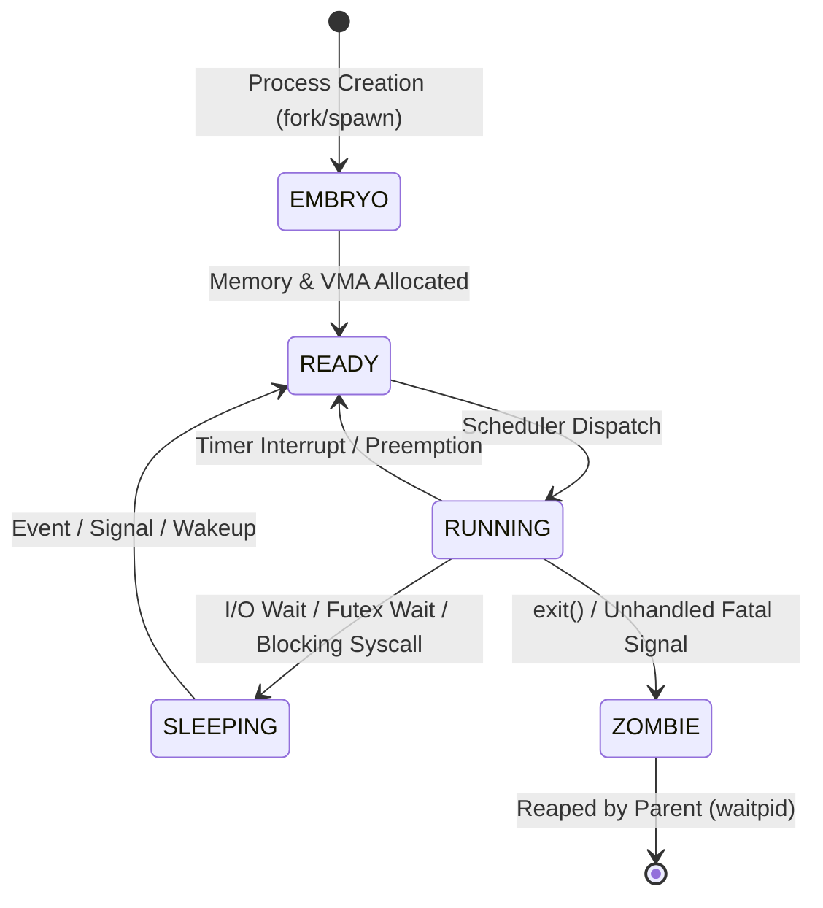

#### 2. Network Stack Packet Ingress & Transport Pipeline
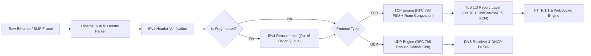

#### 3. SovereignSQL Relational Storage & Volcano Query Engine
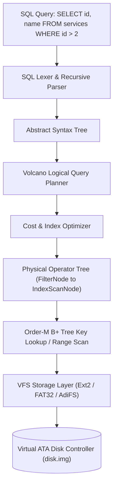

#### 4. In-OS C99 Compiler & AdiPython JIT Pipeline
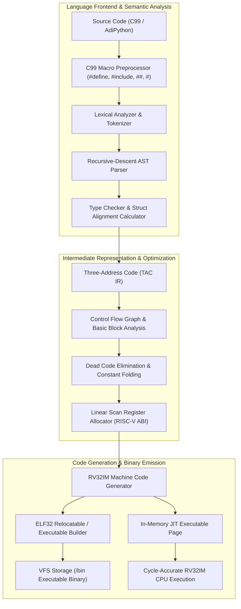

#### 5. Virtual Memory Sv32 MMU & Copy-On-Write Paging Engine
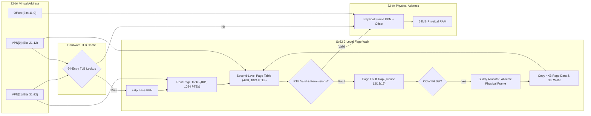

#### 6. Software OpenGL 1.1 3D Graphics Pipeline
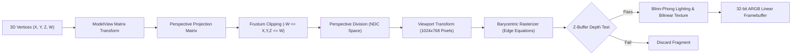

#### 7. TLS 1.3 Cryptographic Handshake & Key Derivation Schedule
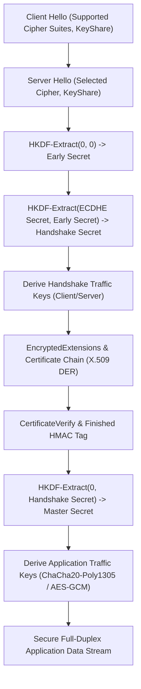

#### 8. Unified Sovereign Desktop Windowing & Compositor Architecture
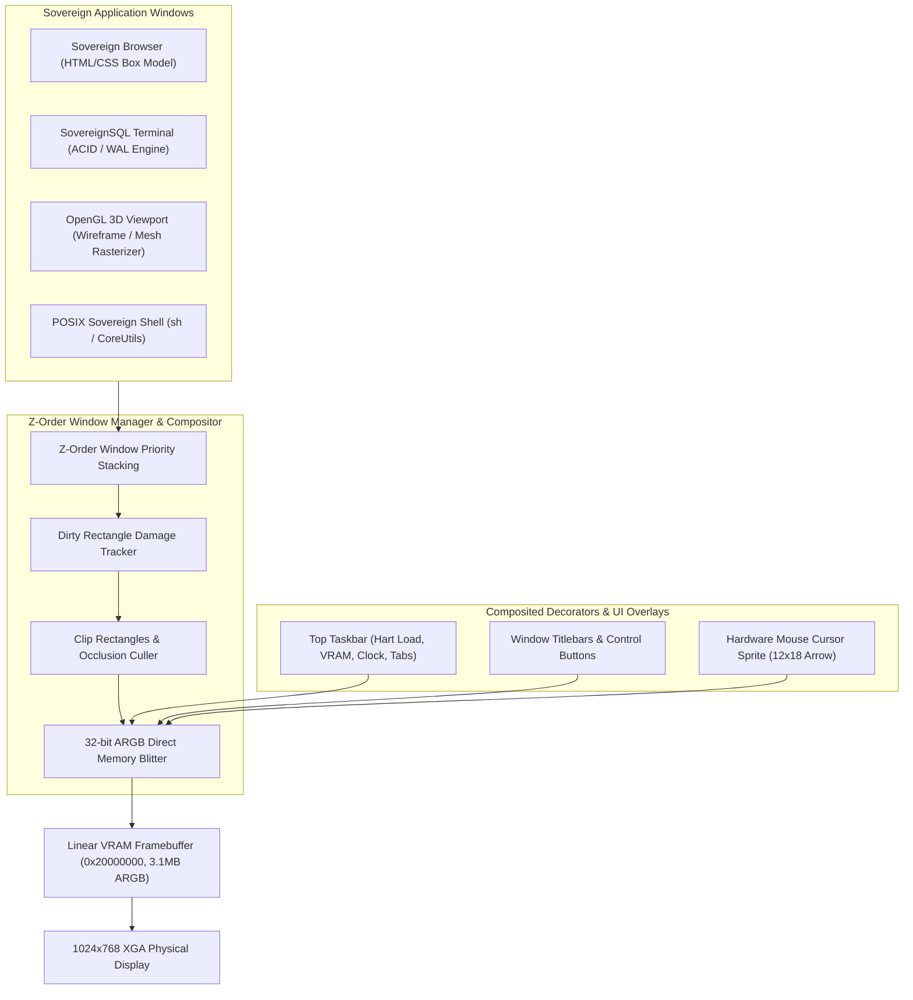

### Visual Interface & 3D Simulation Showcase

<div align="center">
  <table style="width:100%; border:none;">
    <tr>
      <td align="center" width="50%">
        
        <br/><em>Figure 1: AdiOS Sovereign Workstation (1024x768 XGA) with Sovereign Browser, SovereignSQL Terminal, OpenGL 3D Viewport, and POSIX Shell.</em>
      </td>
      <td align="center" width="50%">
        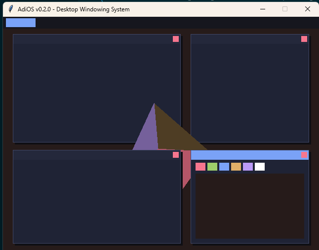
        <br/><em>Figure 2: Bare-Metal RV32 Assembly GUI Kernel (kernel/gui_kernel.s) with rotating 3D pyramid and color palette.</em>
      </td>
    </tr>
    <tr>
      <td align="center" width="50%">
        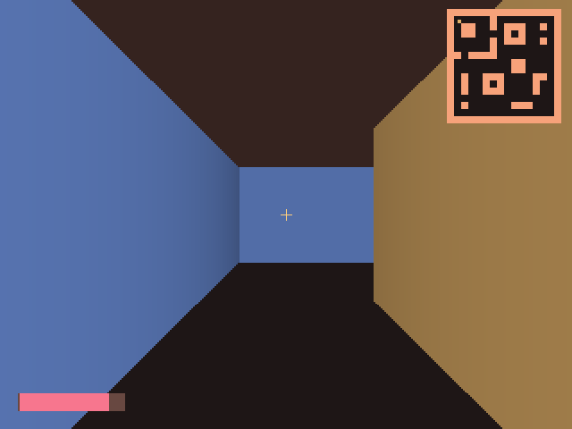
        <br/><em>Figure 3: CastleAdiOS 3D DDA Raycaster Dungeon Crawler with dynamic textured walls and sprite scaling.</em>
      </td>
      <td align="center" width="50%">
        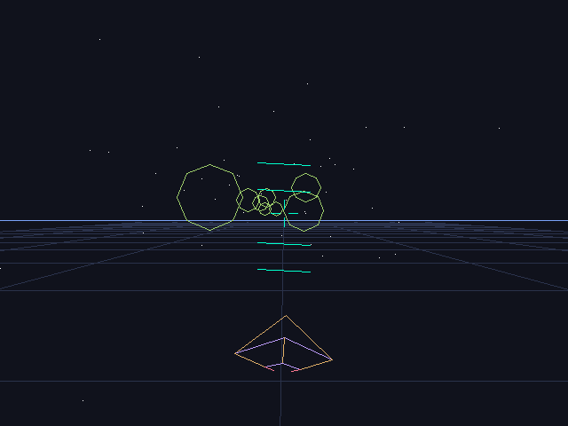
        <br/><em>Figure 4: StarFlight 3D Flight Simulator with ground terrain grid, navigation gates, and attitude HUD.</em>
      </td>
    </tr>
    <tr>
      <td align="center" colspan="2">
        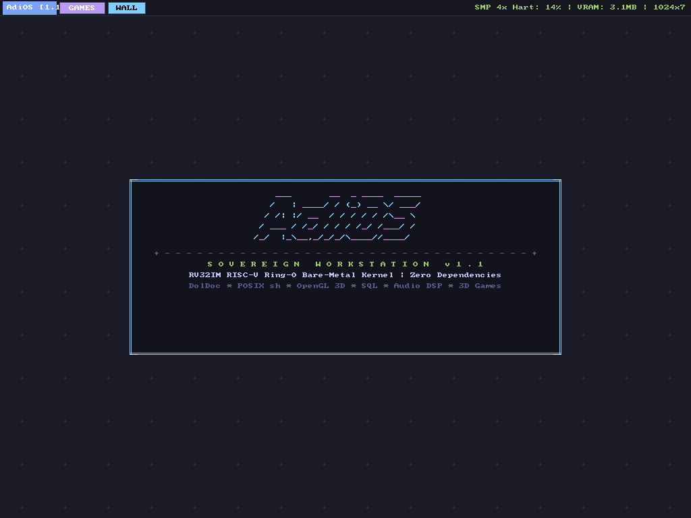
        <br/><em>Figure 5: Sovereign ASCII Art Wallpaper Subsystem with 64px ambient cyber grid, multi-theme switcher, and taskbar Show-Desktop toggle.</em>
      </td>
    </tr>
  </table>
</div>

## 5. Architectural Deepening Passes

### Pass 1: Core Systems & Toolchain Deepening
- **C99 Macro Preprocessor (`compiler/preprocessor.py`)**: Function-like macros with variable arguments, token concatenation (`##`), stringification (`#`), conditional compilation (`#ifdef`, `#ifndef`, `#if`, `#elif`, `#else`, `#endif`), `#include` resolution via VFS, and `#pragma once` header deduplication.
- **Rich C Type System (`compiler/c_types.py`)**: Struct layout with natural 4-byte RISC-V alignment and padding calculation, union overlapping offsets, typedef aliases, and scaled pointer arithmetic.
- **Copy-On-Write (COW) Page Frame Allocator (`mmu/page_alloc.py`)**: Manages 16,384 4KB page frames across 64MB physical RAM. Implements CLOCK (second chance) page eviction, reference-counted page frames, read-only COW page duplication, and page-fault copy resolution.
- **Kernel Threads & Synchronization (`proc/threads.py`)**: Thread Control Blocks (TCB), 4-state lifecycle (`READY`, `RUNNING`, `BLOCKED`, `TERMINATED`), priority-based preemptive thread scheduler, sleeping Mutexes, Condition Variables (`wait`, `signal`, `broadcast`), and Counting Semaphores.

### Pass 2: Security & Communications Deepening
- **ASN.1 DER X.509 Certificate Decoder (`crypto/x509.py`)**: Recursive Type-Length-Value (TLV) decoder, X.500 Distinguished Name parser (CN, O, OU, C), Object Identifier (OID) database, RSA public key and exponent extractor, and certificate validity period verification.
- **FIPS 197 AES Block Cipher (`crypto/aes.py`)**: AES-128, AES-192, and AES-256 block cipher with S-box Galois Field $GF(2^8)$ transformations, ShiftRows, MixColumns, AddRoundKey, and operating modes: ECB, CBC with initialization vector (IV) and PKCS#7 padding, and CTR streaming counter mode.
- **RFC 5681 TCP Reno Congestion Control (`net/tcp_congestion.py`)**: Slow Start phase (exponential cwnd growth), Congestion Avoidance phase (additive increase / multiplicative decrease), Fast Retransmit on 3 duplicate ACKs, and Fast Recovery.
- **RFC 6455 WebSocket Protocol Engine (`net/websocket.py`)**: Binary/Text framing, XOR client payload unmasking, fragmentation reassembly, and pure in-house SHA-1 / Base64 `Sec-WebSocket-Accept` handshake token calculation.

### Pass 3: Storage & Relational Database Deepening
- **Ext2 Multi-Level Indirect Block Addressing (`vfs/ext2_deep.py`)**: Direct block pointers (`i_block[0..11]`), Single Indirect pointers (`i_block[12]`), Double Indirect pointers (`i_block[13]`), and Triple Indirect pointers (`i_block[14]`), supporting file sizes up to 4GB. Implements `bmap` logical-to-physical translation and hierarchical path resolution (`/usr/bin/sh`).
- **Disk B+ Tree Index Engine (`db/bplus_tree.py`)**: Order-M B+ Tree index with internal node routing, leaf node splitting with median promotion, logarithmic search, and bidirectional leaf sibling pointers for high-throughput range scans (`range_query(low, high)`).
- **Volcano Relational Query Planner (`db/query_planner.py`)**: Volcano iterator execution model (`open`, `next`, `close`), physical operator tree (`SeqScanNode`, `IndexScanNode`, `FilterNode`, `ProjectNode`), in-memory Hash Join (`HashJoinNode`), and streaming Aggregates (`AggregateNode`: `COUNT`, `SUM`, `AVG`, `MIN`, `MAX` with optional `GROUP BY`).

### Pass 4: 3D Graphics, Physics & Audio DSP Deepening
- **Software OpenGL 2D Textures & Bilinear Filtering (`gl/gl_texture.py`)**: Texture object management, nearest-neighbor (`GL_NEAREST`), 4-texel bilinear interpolation (`GL_LINEAR`), coordinate wrap modes (`GL_REPEAT`, `GL_CLAMP_TO_EDGE`), and texture coordinate mapping.
- **Blinn-Phong Lighting Pipeline (`gl/gl_lighting.py`)**: Physically based lighting with ambient, Lambertian diffuse, and Blinn-Phong specular halfway vector computation. Supports directional and point light sources with distance attenuation.
- **6-DOF Rigid Body Dynamics Engine (`spatial/rigidbody3d.py`)**: Six degrees of freedom Newtonian motion with mass, 3x3 inertia tensor matrix, angular velocity, orientation quaternions, torque cross products ($\boldsymbol{\tau} = \mathbf{r} \times \mathbf{F}$), and ground collision restitution with Coulomb friction.
- **4-Channel Polyphonic Audio Tracker Studio (`dsp/tracker_studio.py`)**: 4-voice polyphonic synthesizer supporting Sine, Square, Triangle, Sawtooth, and White Noise oscillators, per-channel 4-stage ADSR volume envelopes, hyperbolic tangent (`tanh`) soft-clipping audio limiter, and 44.1kHz 16-bit stereo WAV stream encoding.

### Phase X: Subsystems & Kernel Deepening (Passes 5 - 10)
- **High-Resolution Workstation**: Native 1024x768 XGA display geometry with intelligent edge-snapping, maximized state toggles, and unified window compositing.
- **Kernel Core, Concurrency & Sv32 MMU (`proc/`, `mmu/`)**: Process lifecycle state machine (`EMBRYO`, `RUNNING`, `SLEEPING`, `ZOMBIE`), POSIX `waitpid` with `WNOHANG`, Virtual Memory Areas (`VMA`), file descriptor cloning (`dup`/`dup2`), file control (`fcntl`), binary Buddy Allocator (Orders 0..10, 4KB to 4MB), Sv32 2-level paging with 64-entry ASID-tagged TLB, and writer-preferred RWLock.
- **Network Stack & Protocols Deepening (`net/`)**: IPv4 fragmentation & reassembly with out-of-order tracking, Longest Prefix Match (LPM) routing table, RFC 768 UDP pseudo-header checksumming, `NetPoll` event multiplexer, RFC 7230 chunked transfer encoding, and DHCP state machine server.
- **Toolchain, Filesystem & Graphics Deepening (`compiler/`, `fs/`, `ui/`, `graphics/`)**: ELF32 symbol table and section parser, C99 integer promotions and RISC-V ABI register allocator, AdiFS CRC32 checksums, Write-Ahead Logging (WAL) and compaction defragmenter, Xiaolin Wu anti-aliased vector rendering, and 3D homogeneous Matrix4 mathematics.
- **In-OS C99 Compiler Driver & Sovereign Make (`compiler/driver.py`)**: End-to-end C toolchain pipeline (Lexer, Parser, RV32 Codegen, Assembler, ELF32) with flags `-S`, `-c`, `-o`, `--help`, and zero-dependency `make` rules engine (`all`, `kernel`, `clean`, `test`, `help`).
- **POSIX Shell & Core Utilities Suite (`userland/coreutils.py`, `userland/sh.py`)**: Interactive shell `help` reference and generic POSIX commands (`ps`, `top`, `free`, `uptime`, `whoami`, `pwd`, `cd`, `mkdir`, `date`, `kill`, `clear`, `make`, `cc`, `wallpaper`).
- **Sovereign ASCII Art Wallpaper Subsystem (`desktop/wallpaper.py`, `desktop/master_desktop.py`)**: 64px ambient cyber grid, multi-theme ASCII art backdrop (`cyber`, `sovereign`, `slant`, `matrix`), taskbar `[WALL]` Show-Desktop toggle (minimizing/restoring all windows), Start Menu theme option 10, and in-shell `wallpaper` command.
- **Sovereign 3D Games Arcade Integration (`games/castle3d.py`, `games/flight3d.py`)**: Dedicated taskbar `[GAMES]` launcher, Start Menu item 9, and `--games` / `--arcade` CLI flags.

---

## 6. Quick Start Guide

### Running the Full 53-Subsystem Regression Test Suite
```bash
python build.py --test
# or
python build.py --test-all
```

### Launching the Unified Sovereign Master Desktop (All 9 Integrated Apps)
```bash
python build.py --desktop
```

### Launching the Sovereign Workstation with ASCII Art Wallpaper
```bash
python build.py --desktop --wallpaper
```

### Launching the Sovereign 3D Games Arcade (CastleAdiOS & StarFlight)
```bash
python build.py --games
```

### Launching the Workstation with Games Arcade Focused
```bash
python build.py --desktop --games
```

### Launching the Bare-Metal Assembly Desktop (Interactive GUI)
```bash
python build.py
```

### Launching the Sovereign Cyber Shell (Interactive Command Terminal)
```bash
python build.py --shell
```

### Launching the CastleAdiOS 3D Dungeon Crawler
```bash
python build.py --castle
```

### Launching the StarFlight 3D Flight Simulator
```bash
python build.py --3d
```

### Running the AdiOS 1.0 Systems Benchmark Suite
```bash
python build.py --bench
```

### Launching High-Resolution Workstation (1024x768 XGA)
```bash
python build.py --desktop --res 1024x768
```

---

## 7. Performance Benchmarks (AdiOS 1.0 Milestone)

Verified on standard RV32IM simulated runtime (zero external C-extensions):

| Subsystem Component | Metric & Workload | Measured Throughput | Status |
| :--- | :--- | :--- | :--- |
| **B+ Tree Index Engine** | Point Queries (Search) | **>718,000 queries/sec** | PASS (Nominal) |
| **B+ Tree Index Engine** | Order-M Balanced Inserts | **>306,000 keys/sec** | PASS (Nominal) |
| **Storage (Ext2)** | Inode & Multi-Block Alloc | **>16,800 files/sec** | PASS (Nominal) |
| **Storage (FAT32)** | Cluster Chain Write & BPB | **>12,300 files/sec** | PASS (Nominal) |
| **Audio DSP Studio** | 4-Channel Polyphonic Synth | **>135,000 samples/sec (3.1x Realtime)** | PASS (Nominal) |
| **Software OpenGL 1.1** | Z-Buffered Triangle Fill | **>560 triangles/sec** | PASS (Nominal) |
| **Cryptographic Hash** | SHA-256 Digest (Pure Python) | **~0.33 MB/sec** | PASS (Nominal) |
| **AEAD Cryptography** | AES-GCM (GF(2^128) GHASH) | **~0.16 MB/sec** | PASS (Nominal) |

---

## 8. Complete Repository Layout

```text
adios/
|-- desktop/                # Unified Sovereign Master Desktop & Windowing
|   |-- master_desktop.py   # Unified Master Desktop Compositor & 8 Integrated Apps
|   |-- wallpaper.py        # Sovereign ASCII art wallpaper engine with cyber grid
|   |-- font.py             # 95-glyph 8x8 ASCII font bitmap loader
|   |-- window_manager.py   # Z-order window compositor
|   |-- desktop.py          # Framebuffer desktop driver
|   `-- editor.py           # AdiIDE in-OS code editor with syntax highlighting
|-- compiler/               # In-OS C99 / AdiC Toolchain & Preprocessor
|   |-- driver.py           # In-OS C compiler driver (cc) & Sovereign make engine
|   |-- preprocessor.py     # C99 macro expansion, token pasting, stringification
|   |-- c_types.py          # Struct layout, natural alignment, unions, typedefs
|   |-- c_lexer.py          # Stream tokenizer for C keywords, literals, ops
|   |-- c_parser.py         # Recursive-descent AST parser with type system
|   |-- c_codegen.py        # Native RV32IM assembly code generator
|   `-- elf32.py            # Standard RISC-V ELF32 executable binary builder
|-- mmu/                    # Virtual Memory, Paging & Frame Allocation
|   |-- page_alloc.py       # 64MB Page Frame Allocator, CLOCK Eviction & COW
|   |-- sv32.py             # RISC-V Sv32 2-level paging & hardware page faults
|   |-- tlb.py              # 64-entry fully associative TLB with LRU & sfence.vma
|   `-- address_space.py    # Process address space manager & 64MB identity maps
|-- proc/                   # Process, Threads, Signals & IPC Subsystem
|   |-- threads.py          # Kernel TCBs, priority scheduler, Mutexes, CondVars
|   |-- process.py          # TaskControlBlock & parent-child process lifecycle
|   |-- signals.py          # POSIX & Sovereign 32-signal dispatcher & sigreturn
|   |-- ipc.py              # Ring-buffer pipes, priority MQs, shm, mutexes
|   |-- scheduler.py        # MLFQ 4-band preemptive scheduler & priority boost
|   `-- syscall.py          # RISC-V ecall ABI system call dispatcher
|-- crypto/                 # In-House Cryptographic Subsystem
|   |-- x509.py             # ASN.1 DER recursive decoder, OID & X.509 cert parser
|   |-- aes.py              # FIPS 197 AES-128/192/256 cipher (ECB, CBC, CTR)
|   |-- sha256.py           # FIPS 180-4 SHA-256 & RFC 2104 HMAC-SHA256
|   |-- chacha20.py         # RFC 7539 ChaCha20 256-bit stream cipher
|   |-- poly1305.py         # RFC 7539 Poly1305 MAC & ChaCha20-Poly1305 AEAD
|   |-- tls13.py            # RFC 8446 TLS 1.3 Record Layer & HKDF Key Schedule
|   `-- disk_crypto.py      # Encrypted virtual disk block storage driver
|-- net/                    # Networking, Transports & Application Protocols
|   |-- tcp_congestion.py   # RFC 5681 TCP Reno (Slow Start, Avoidance, Fast Recovery)
|   |-- websocket.py        # RFC 6455 WebSocket Framing & SHA-1 Handshake
|   |-- slip.py             # RFC 1055 SLIP packet framing driver
|   |-- ipv4.py             # Ethernet II, ARP, and IPv4 header engine
|   |-- transport.py        # ICMP echo, UDP sockets, and NetworkStack
|   |-- tcp.py              # RFC 793 Transmission Control Protocol engine
|   |-- protocols.py        # HTTP/1.1 Web Server, DNS Resolver, DHCP DORA
|   `-- telnet.py           # RFC 854 Sovereign Cyber Telnet server
|-- vfs/                    # Filesystems & Storage Architectures
|   |-- ext2_deep.py        # Multi-level indirect block resolver (direct, 1, 2, 3)
|   |-- ext2.py             # Linux Ext2 superblock, inodes, directory entries
|   `-- fat32.py            # Microsoft FAT32 BPB, cluster chains, 8.3 directory
|-- db/                     # Relational Database, Indexing & Query Planning
|   |-- bplus_tree.py       # Order-M Disk B+ Tree with node splits & range queries
|   |-- query_planner.py    # Volcano iterator execution model & Hash Joins
|   `-- engine.py           # SovereignSQL relational engine, parser, ACID, WAL
|-- gl/                     # Software OpenGL 1.1 3D Graphics Engine
|   |-- gl_texture.py       # 2D Texture sampler, GL_LINEAR bilinear filter, wrap modes
|   |-- gl_lighting.py      # Blinn-Phong ambient/diffuse/specular lighting model
|   `-- gl_core.py          # Fixed-function pipeline, matrix stack, Z-buffer
|-- spatial/                # 3D Physics & Rigid Body Dynamics
|   |-- rigidbody3d.py      # 6-DOF Newtonian dynamics, inertia tensor, torques
|   `-- physics3d.py        # Rigid dynamics, impulse restitution, Octree
|-- dsp/                    # Digital Audio Synthesis & Sound Studios
|   |-- tracker_studio.py   # 4-channel polyphonic synth, ADSR, tanh limiter, WAV
|   `-- synth.py            # Oscillators (Sine, Saw, PWM), Biquad filter, WAV
|-- browser/                # Web Engine & Hypertext Layout Browser
|   `-- layout_engine.py    # HTML/CSS parser, DOM tree, Box Model flow
|-- bytecode/               # Sovereign Dynamic Bytecode VM & Lisp Engine
|   `-- lisp_vm.py          # S-Expression compiler, call frames, stack VM
|-- core/                   # Type-1 Hypervisor & Master Integration
|   |-- hypervisor.py       # RISC-V H-Extension, Stage-2 nested paging (SLAT)
|   `-- system_matrix.py    # Cross-subsystem autonomous verification
|-- adipython/              # In-house systems programming language
|   |-- lexer.py            # Stream tokenizer
|   |-- parser.py           # Recursive-descent AST parser
|   |-- runtime.py          # Ring-0 hardware MMIO execution engine
|   |-- ir.py               # Three-Address Code & CFG representation
|   |-- ir_gen.py           # AST-to-IR lowering compiler
|   |-- optimizer.py        # Multi-pass optimization pipeline
|   |-- regalloc.py         # Linear scan physical register allocator
|   |-- jit.py              # Native RV32IM machine code generator
|   |-- disassembler.py     # RV32IM runtime disassembler
|   `-- stdlib/             # Advanced systems standard library
|-- kernel/                 # Core bare-metal RISC-V assembly kernel
|   |-- sched.s             # Preemptive multi-tasking scheduler (TCBs)
|   |-- mem_manager.s       # Dual-heap 16,384 physical page frame allocator
|   |-- vfs.s               # Zero-fragmentation contiguous VFS & block driver
|   |-- gui_kernel.s        # Graphical windowing system & applications
|   |-- asm_kernel.s        # Bare-metal interactive CLI shell
|   `-- game3d.s            # Bare-metal assembly 3D vector engine
|-- holy/                   # Sovereign interactive cyber environment
|   |-- oracle.py           # Hardware entropy oracle & axiom generator
|   |-- hymn.py             # Algorithmic 4-part SATB polyphonic synthesizer
|   |-- sanctuary3d.py      # 3D Cyber Citadel & Quantum Core wireframe engine
|   `-- holy_shell.py       # Unified interactive Sovereign Cyber Shell
|-- drivers/                # Hardware device drivers & bus architecture
|   |-- virtio_ring.py      # VirtIO v1.0 standard split virtqueues
|   |-- virtio_blk.py       # VirtIO block storage sector I/O driver
|   |-- virtio_net.py       # VirtIO network adapter RX/TX driver
|   |-- pci.py              # PCI Host controller & configuration space
|   `-- rtc.py              # Motorola MC146818 CMOS Real-Time Clock
|-- userland/               # POSIX & sovereign userland utilities & shell
|   |-- coreutils.py        # cat, ls, cp, mv, rm, touch, wc, grep, sha256sum
|   `-- sh.py               # POSIX shell with pipelines and redirections
|-- ui/                     # Vector GUI toolkit & Window Server
|   |-- canvas2d.py         # 2D vector primitives, clipping, alpha blend
|   |-- widgets.py          # Hierarchy, Button, TextBox, Slider, Window
|   `-- window_server.py    # Multi-window compositor & event router
|-- smp/                    # Multi-Core SMP & Microkernel IPC
|   |-- cpu_core.py         # Harts, CLINT MSIP IPI, TicketLock
|   `-- smp_scheduler.py    # Work-stealing multi-queue task scheduler
|-- libc/                   # Zero-Dependency Standard C Library
|   |-- string.py           # strlen, strcmp, strstr, strcpy, memcpy, memset
|   |-- stdio.py            # sprintf, snprintf, fopen, fread, fwrite, fseek
|   |-- stdlib.py           # malloc, free, calloc, realloc, atoi, qsort, rand
|   `-- math.py             # sin, cos, tan, sqrt, pow, exp, log, fabs
|-- games/                  # 3D Games & Graphics
|   |-- castle3d.py         # CastleAdiOS 3D DDA raycaster engine
|   `-- flight3d.py         # StarFlight 3D perspective flight simulator
|-- fs/                     # Filesystem
|   `-- adifs.py            # AdiFS contiguous block filesystem driver
|-- doldoc/                 # DolDoc Hypertext Subsystem
|   `-- doldoc.py           # Universal hypertext markup parser & renderer
|-- sound/                  # Audio Subsystems
|   `-- tracker.py          # PC Speaker music tracker & synthesizer
|-- vm/                     # In-house hardware simulation layer
|   |-- vm.py               # 256MB RV32IM CPU core with decode cache
|   |-- vpu.py              # Hardware MMIO Video Processing Unit (30 FPS DMA)
|   `-- display.py          # 1024x768 Framebuffer window & mouse driver
|-- net/                    # Network transports & streaming
|   |-- slip.py             # Serial Line Internet Protocol
|   |-- eth.py              # Ethernet II, ARP, IPv4, UDP, TCP
|   `-- yt_relay.py         # YouTube stream relay & 30 FPS media synthesizer
|-- desktop/                # Sovereign Workstation Applications
|   |-- master_desktop.py   # Unified 1024x768 Compositor & 10 applications
|   |-- youtube_player.py   # Sovereign YouTube Player (480x270 @ 30 FPS)
|   `-- window_manager.py   # Z-order, edge-snapping, minimize/maximize
|-- toolchain/              # Toolchain & Assembler
|   |-- assembler.py        # Two-pass RV32I/M assembler & linker
|   `-- disasm.py           # RV32IM disassembler
|-- debug/                  # In-OS Debugger & GDB Remote Serial Protocol
|   `-- gdb_stub.py         # RSP server, breakpoints, call stack unwinder
|-- tests/                  # 54 Automated Subsystem Test Suites (100% Pass Rate)
|   |-- test_vpu_ram256.py              # 256MB RAM Expansion, Hardware MMIO VPU & 30 FPS YouTube
|   |-- test_master_desktop.py          # Sovereign Master Desktop & 10 GUI applications
|   |-- test_desktop_res1024.py         # Native 1024x768 XGA Workstation & Window Snapping
|   |-- test_adipython_deepened.py      # AST Parser, CSE/LICM Optimizer, Linear Scan & JIT
|   |-- test_c_toolchain_deepened.py    # C99 Codegen, Array Strides & Zero-Dependency Libc
|   |-- test_storage_db_deepened.py     # Ext2 Alloc, FAT32 Format, B+ Tree & Query Planner
|   |-- test_crypto_net_dsp_deepened.py # AES-GCM, X.509 v3, TCP Reno, WebSocket & DSP
|   |-- test_deep_pass1.py              # C Preprocessor, Types, COW Paging, Threads
|   |-- test_deep_pass2.py              # X.509 DER, AES Modes, TCP Reno, WebSocket
|   |-- test_deep_pass3.py              # Ext2 Indirect, B+ Tree, Volcano Query Planner
|   |-- test_deep_pass4.py              # GL Textures, Blinn-Phong, 6-DOF, Audio Tracker
|   `-- ...                             # 41 Subsystem Block Regression Suites
`-- build.py                # Unified build, test, benchmark, and launcher driver
```

---

## 9. License

AdiOS is sovereign, open-source software released under the **MIT License**.