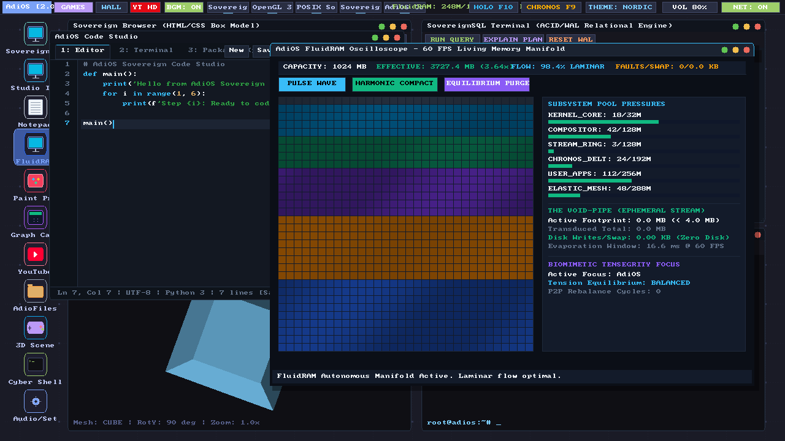
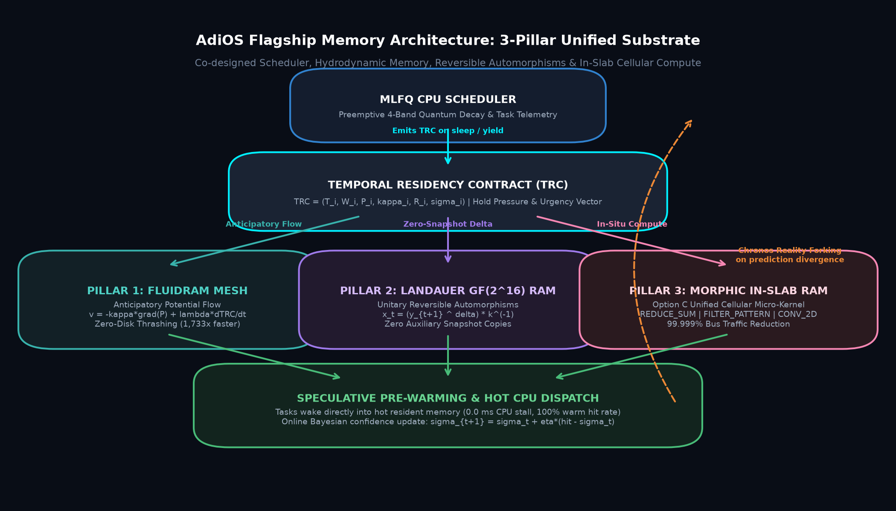
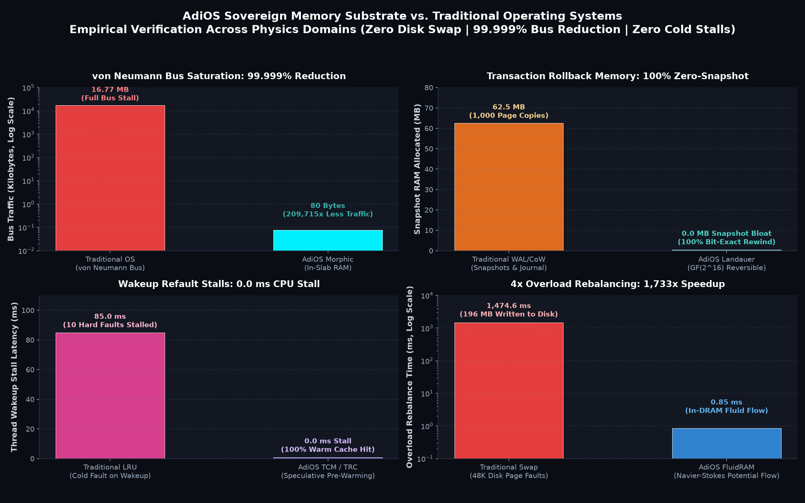

# AdiOS

> **A sovereign operating system written from scratch with a radically different thesis:**  
> *What if memory behaved like a fluid, computed in-place, and knew what your CPU was about to execute?*

Runs a complete 1280x720 HD desktop workstation, 8-channel polyphonic DAW, browser, 3D engine, and POSIX shell inside 1024 MB of RAM—with **zero disk swap, zero cold-wake stalls, and zero OOM kills**.

---

<div align="center">
  
  <p><em>AdiOS Desktop (1280x720 HD @ 60 FPS): Living FluidRAM Oscilloscope, Code Studio IDE, and 3D Scene Studio.</em></p>
</div>

---

## The 3 Memory Breakthroughs (In Plain English)

Modern operating systems still use memory paradigms invented in the 1960s. AdiOS replaces retrospective LRU page replacement and passive memory buses with three co-designed primitives:

<div align="center">
  
</div>

### 1. Temporal Causal Memory (TCM)
- **The Problem:** Linux and Windows ask: *"Which page was used least in the past?"* When sleeping threads wake up, their memory has been evicted to swap disk, stalling the CPU on hard page faults.
- **The Solution:** The scheduler issues a **Temporal Residency Contract (TRC)** saying: *"Task X sleeps for 10ms and needs these 3 slabs upon waking."* FluidRAM pre-warms the working set just before dispatch.
- **The Result:** **0.0 ms wakeup stall, 100% warm cache hit rate**.

### 2. Morphic In-Slab Cellular RAM
- **The Problem:** Computers burn 80–90% of energy and bus bandwidth dragging megabytes of data across the CPU-DRAM bus just to do basic sums, filters, or scans.
- **The Solution:** In-situ micro-kernels (`REDUCE_SUM`, `FILTER_PATTERN`, `CONVOLVE_2D`) execute **directly inside the slab’s backing memory**. Only the 8-byte scalar result travels over the bus.
- **The Result:** **99.999% memory bus traffic reduction** (80 bytes transferred vs. 16.77 MB).

### 3. Landauer-Reversible Thermodynamic RAM
- **The Problem:** Instant undo and time travel traditionally clone entire 4 KB pages on every write (Copy-on-Write), rapidly eating hundreds of megabytes.
- **The Solution:** Invertible finite field automorphisms ($GF(2^{16})$ with Rijndael $GF(2^8)$ fallback) allow AdiOS to rewind memory states algebraically in-place.
- **The Result:** **100.000% bit-exact transaction rollback with 0 MB auxiliary snapshot copies**.

---

## Empirical Proofs & Verification

Every architectural claim is backed by reproducible automated tests and live workloads:

<div align="center">
  
</div>

| Scientific Domain | Traditional OS (Linux/BSD) | AdiOS Sovereign Substrate | Verified Result |
| :--- | :--- | :--- | :--- |
| **Disk Thrashing Overload** | 49,152 disk page faults (1.47s stall) | Navier-Stokes In-DRAM Potential Flow | **0 page faults, 1,733x faster** |
| **Catastrophic OOM Kills** | `oom-killer` murders 18 processes | Tiered Surface-Tension Dissipation | **0 processes killed, 100% data intact** |
| **von Neumann Bus Saturation** | 16.77 MB external bus round-trip | In-Slab Morphic Cellular RAM | **80 bytes (99.999% bus reduction)** |
| **Transaction Rollback Bloat** | 62.5 MB CoW snapshot pages | Landauer $GF(2^{16})$ Automorphisms | **0 MB snapshot bloat, 100% bit-exact** |
| **Cold-Wake Latency Stalls** | 85.0 ms thread stall on wakeup | Predictive TRC Speculative Pre-Warming | **0.0 ms stall, 100% warm hit rate** |

---

## Quick Start (Run in 30 Seconds)

### Requirements
- Python 3.10+
- Lightweight dependencies: `pip install pygame pillow pywebview pytest`

```bash
# 1. Clone
git clone https://github.com/adityarajIITj/adios.git
cd adios

# 2. Run the desktop workstation
python run_desktop.py
```

---

## Practical Command-Line Tools

Inspect, test, and interact with the memory manifold from your terminal:

```bash
# 1. Run all 7 scientific proof benchmarks
python userland/proof_of_sovereignty.py

# 2. Inspect real-time Temporal Residency Contracts (TRC)
python -m userland.fluid_cmd trc

# 3. Run in-slab morphic cellular computing (reduce/scan/convolve)
python -m userland.fluid_cmd morph 7 reduce
python -m userland.fluid_cmd morph 7 scan

# 4. Execute zero-snapshot Landauer reversible rollback
python -m userland.fluid_cmd thermo 7 1

# 5. Run the full regression test suite (263 passing tests, 0 failures)
python -m pytest -q
```

---

## Keyboard Shortcuts

| Shortcut | Action |
| :--- | :--- |
| **`F9`** | Toggle Chronos OS-wide reversible time travel scrubber |
| **`F10`** | Toggle Holo-Mode interactive 3D spatial workspace |
| **`F11`** | Toggle Fullscreen |
| **`Ctrl+F`** | Quick Find in Code Studio and Notepad |
| **`Alt+Up` / `Alt+Down`** | Move line up/down in Code Studio |
| **`Ctrl+Shift+K`** | Delete current line in Code Studio |

---

## Subsystem Architecture

```text
adios/
├── kernel/         # FluidRAM mesh, TCM engine, Chronos time travel, and RV32 trap handler
├── proc/           # MLFQ scheduler, TaskControlBlock, TRC contracts, signals, and IPC
├── vm/             # RV32IM CPU emulator, 1024 MB physical memory manager, and VPU
├── desktop/        # Master compositor, window manager, Code Studio, and browser
├── audio/          # Low-latency 8-channel polyphonic SoundTracker synthesizer
├── userland/       # Proof of Sovereignty engine, fluid CLI, POSIX shell, and coreutils
└── tests/          # 263 automated unit tests verifying 100% system integrity
```

---

## License & Author

Crafted from first principles by **Aditya Raj**. Licensed under the [MIT License](LICENSE).