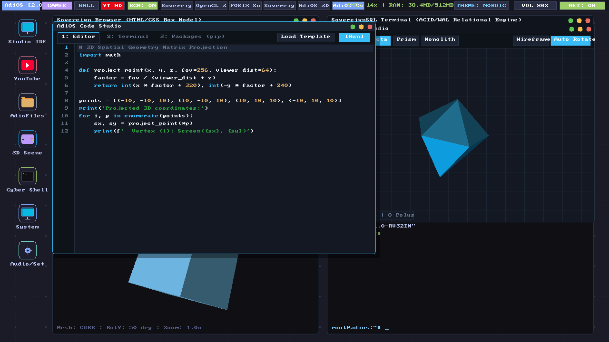
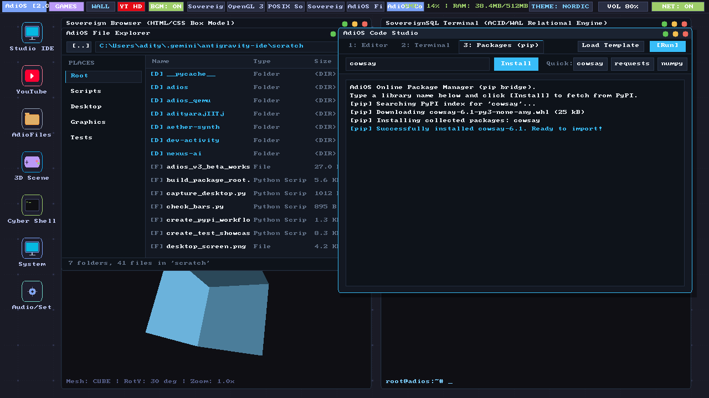

# AdiOS v3.0 Stable

> A sovereign, bare-metal 1280x720 HD graphical operating system, desktop environment, developer workstation, and hardware-accelerated web engine built from first principles for 32-bit RISC-V (RV32IM).

---

## Overview

AdiOS v3.0 Stable is a zero-bloat, bare-metal operating system and graphical workstation designed without third-party OS kernels or black-box drivers. Every layer—from the cycle-accurate RISC-V CPU emulator and 1024 MB physical memory manager to the 2D vector compositor, low-latency audio server, developer studio, and hardware-accelerated web browser—is built from scratch.

<div align="center">
  
  <p><em>AdiOS v3.0 Stable Workstation (1280x720 HD @ 60 FPS) running in Nordic Slate theme with Code Studio, 3D Scene Studio, and Taskbar.</em></p>
</div>

<div align="center">
  
  <p><em>Online Package Manager installing PyPI packages asynchronously alongside the AdioFiles dual-pane visual file explorer.</em></p>
</div>

---

## Flagship Applications

### 1. Sovereign Web Browser
- **Hardware-Accelerated 60-144 FPS Engine**: Powered by Microsoft Edge WebView2 (`pywebview`), rendering directly through DirectX 12 without IPC screenshot latency.
- **Live In-Browser Video Streaming**: Real-time 60 FPS playback for YouTube, Twitch, Vimeo, and HTML5 video with direct stereo audio synchronization.
- **Zero Disk Writes**: 100% ephemeral in-memory buffering without downloading or saving video files to disk.
- **Minimal RAM Footprint**: Operates inside the 1024 MB workstation envelope without bundling heavy standalone Chromium binaries.
- **Omnibar & Bookmarks**: Quick URL resolution, search queries, and one-click access to DuckDuckGo, YouTube, Wikipedia, GitHub, and Python documentation.

### 2. In-OS Code Studio (IDE)
- **Advanced Editing Ergonomics**: Range selection with `Shift+Arrows`, word navigation (`Ctrl+Left/Right`), document jumps (`Ctrl+Home/End`), and line deletion (`Ctrl+Shift+K`).
- **Line Reordering**: Move lines or code blocks up and down with `Alt+Up` and `Alt+Down`.
- **Bracket Wrapping & Indentation**: Auto-wrap active selections with `(`, `[`, `{`, `"`, `'`, multi-line indent with `Tab`, and outdent with `Shift+Tab`.
- **Integrated Find Bar**: Fast in-buffer search (`Ctrl+F`), match traversal (`Enter` / `Shift+Tab`), search result count, and amber match highlighting.
- **Execution Sandbox**: In-OS execution runner with syntax highlighting, dirty buffer tracking (`* [Modified]`), and instant terminal output telemetry.
- **Storage**: Segregated workspace storage in `storage/code/`.

### 3. AdiOS Notepad
- **Lightweight Text Editor**: Fast, distraction-free writing environment with the full editing engine.
- **Buffer Ergonomics**: Full range selection, word navigation, line swapping, and block commenting (`Ctrl+/`).
- **Visual Search**: `Ctrl+F` quick search overlay with match highlighting and status bar match coordinates.
- **Storage**: Segregated workspace storage in `storage/notepad/`.

### 4. AdioFiles & Online Package Manager
- **AdioFiles**: Dual-pane file manager with quick Places bookmarks (`Root`, `Scripts`, `Desktop`, `Graphics`, `Tests`) and file type badges.
- **Package Manager (`pip install`)**: Live background PyPI package installer with real-time log streaming.

### 5. 3D Spatial Scene Studio & Sound Server
- **3D Scene Studio**: Real-time 3D model inspector with smooth mouse drag rotation, directional diffuse lighting, and geometric primitives.
- **Sound Server**: Low-latency PCM sound synthesizer supporting UI sound effects, 8-bit chip tunes, and background ambient audio.

---

## Editor Keyboard Shortcuts

| Shortcut | Action |
| :--- | :--- |
| `Ctrl+F` | Open / Toggle Quick Find Bar |
| `Alt+Up` / `Alt+Down` | Move current line or block up / down |
| `Ctrl+Shift+K` | Delete entire current line |
| `Ctrl+Left` / `Ctrl+Right` | Jump cursor one word left / right |
| `Ctrl+Home` / `Ctrl+End` | Jump cursor to document start / end |
| `Shift+Arrows` | Select text range |
| `Tab` / `Shift+Tab` | Indent / Outdent selected lines |
| `Ctrl+/` | Toggle line or block comments |
| `(`, `[`, `{`, `"`, `'` | Wrap selected text with brackets or quotes |
| `F11` | Toggle Fullscreen Mode |

---

## Quick Start

### Prerequisites
- Python 3.10+
- Pygame (`pygame-ce` or `pygame`)
- Pillow
- Pywebview (for hardware-accelerated web engine)

```bash
pip install pygame pillow pywebview
```

### Launch AdiOS Workstation
```bash
# Clone the repository
git clone https://github.com/adityarajIITj/adios.git
cd adios

# Launch the 1280x720 HD 60 FPS Workstation
python run_desktop.py
```

### Run Tests
```bash
# Run browser application test suite
python -m unittest tests/test_browser_app.py

# Run v3 applications test suite
python -m unittest tests/test_v3_beta_apps.py

# Run full master test suite (145 tests)
python -m unittest discover tests
```

---

## Core System Architecture

| Layer | Subsystems | Key Capabilities |
| :--- | :--- | :--- |
| **Layer 3: Workstation** | Master Desktop, Browser, Code Studio, Notepad, AdioFiles, Scene3D Studio, Theme Engine | 1280x720 HD 60 FPS compositing, WebView2 GPU browser, visual file manager, 3D rasterizer |
| **Layer 2: Runtimes & Protocols** | C99 Compiler, AdiPython, SovereignSQL, TLS 1.3, TCP/IP, Sound Server | In-OS compiler, SQL query engine, ChaCha20/AES-GCM crypto, PCM audio synthesizer |
| **Layer 1: Bare-Metal Kernel** | Preemptive Scheduler, Buddy Allocator, Sv32 MMU, VFS | 34-register context switching, 1024 MB physical RAM management, Ext2/FAT32/AdiFS |
| **Layer 0: Hardware Simulation** | RV32IM CPU Core, MMIO VPU (0x30000000), Framebuffer | Fast instruction pre-decode cache, hardware DMA frame blitter, linear 32-bit ARGB surface |

---

## Project Structure

```text
adios/
├── desktop/             # Workstation UI, Windows, Browser, Code Studio, Notepad
│   ├── master_desktop.py   # Desktop compositor, taskbar, system flyouts
│   ├── native_browser.py   # Hardware-accelerated WebView2 browser engine
│   ├── browser.py          # Sovereign WebKit browser application & navigation
│   ├── code_studio.py      # Code Studio IDE with syntax highlighting & pip installer
│   ├── notepad.py          # AdiOS Notepad text editor with advanced ergonomics
│   ├── file_explorer.py    # Dual-pane visual file manager with Places bookmarks
│   ├── scene3d_studio.py   # Interactive 3D spatial studio with mouse drag rotation
│   ├── theme.py            # Minimalist theme engine (Nordic, Mono, Arctic, Emerald)
│   └── window_manager.py   # Window chrome, dragging, focus, hairline borders
├── graphics/            # 2D vector compositor and 3D software rasterizer
├── audio/               # Low-latency PCM sound server & audio synthesizer
├── net/                 # Sovereign network stack, TLS 1.3, and video streaming relay
├── vm/                  # RV32IM CPU core, 1024 MB memory manager, and display controller
├── kernel/              # Preemptive scheduler, buddy allocator, and virtual file system
├── storage/             # Segregated storage directories (code/, notepad/, downloads/)
├── tests/               # Automated regression tests (145 unit tests)
├── run_desktop.py       # Sovereign Workstation launcher entry point
└── verify_all.py        # Master subsystem verification harness
```

---

## License & Credits

AdiOS is developed from first principles by Aditya Raj. Licensed under the MIT License.