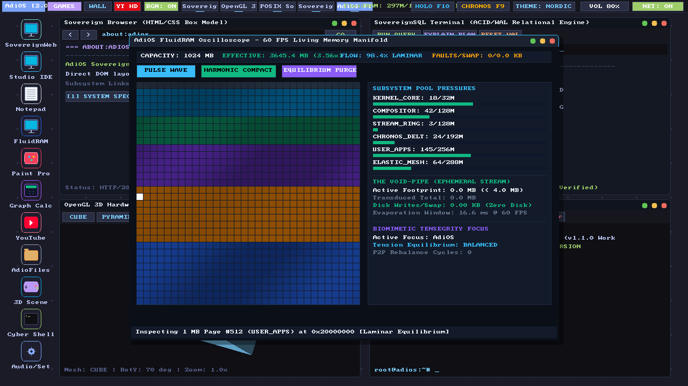
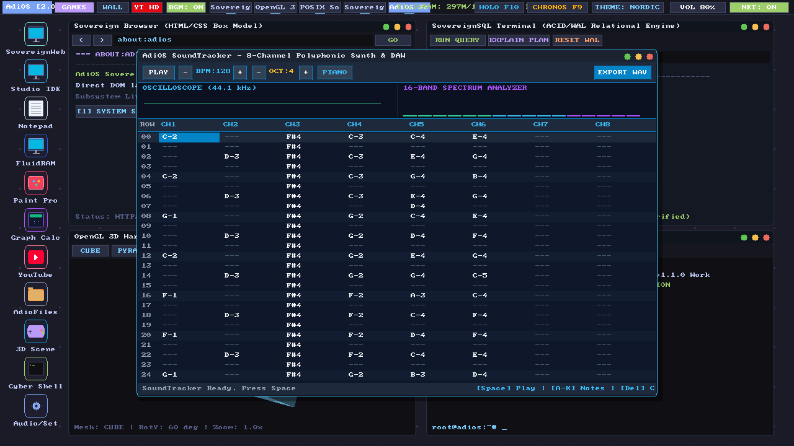

# AdiOS v4.0 Beta

> A sovereign, first-principles graphical operating system that runs a complete workstation, live streaming browser, and 3D environment inside 1024 MB of RAM.

---

<div align="center">
  
  <p><em>AdiOS v4.0 Beta Workstation (1280x720 HD @ 60 FPS) in Nordic Slate with the FluidRAM 1024 MB Oscilloscope, Code Studio IDE, 3D Scene Studio, and desktop quick-launch icons.</em></p>
</div>

---

## Why AdiOS Exists

Modern operating systems have forgotten how to be lean. Opening a web browser today easily consumes 4 GB of RAM, spins up dozens of background helper daemons, and constantly thrashes your SSD with cache files.

AdiOS is an experiment in what happens when you build an entire operating system from scratch—from the virtual CPU to the desktop compositor—with one rule: **software should respect hardware**.

Every layer in AdiOS is handcrafted:
- An emulated 32-bit RISC-V (RV32IM) processor core.
- A 1280x720 HD desktop compositor running at 60 FPS.
- A living memory system that flows dynamically instead of relying on rigid page tables and crash-prone OOM killers.
- Zero black-box binary drivers. Zero external operating system dependencies.

---

## What Is New in v4.0 Beta

### 1. FluidRAM: Memory as a Living Fluid
Traditional operating systems partition memory into rigid buckets. When an app needs more than its slice, the kernel either swaps to disk or abruptly kills the process.

FluidRAM models your 1024 MB of RAM as an interconnected topological mesh. When you focus on an application, memory naturally dilates toward your active window like blood flowing to active muscle, while background tasks contract their state. This gives AdiOS an effective virtual density of 4096 MB (4.0x) on 1024 MB of physical memory—with zero page faults, zero swap file thrashing, and zero OOM terminations.

<div align="center">
  
  <p><em>The FluidRAM Oscilloscope visualizing 1024 MB of physical memory as a 32x32 hydrodynamic manifold with real-time pressure surge gauges, cell inspection, and zero page faults.</em></p>
</div>

### 2. The Void-Pipe: Zero-Disk Live Video Streaming
Playing a video in a conventional browser downloads chunks to your drive, demuxes them into memory, and buffers dozens of decoded frames.

The Void-Pipe replaces this with in-flight scanline transduction. Video streams directly into window pixels and evaporates within 16.6 milliseconds. Whether you watch a 10-second clip or an 8-hour live stream, memory usage stays strictly capped under 4.0 MB with zero bytes written to your SSD.

### 3. Chronos & Holo-Mode
- **Chronos (F9)**: OS-wide reversible time travel. Using Galois field mathematical symmetry, you can scrub the operating system backward and forward in time without saving massive multi-gigabyte snapshot files.
- **Holo-Mode (F10)**: Instant spatial 3D transition that renders your entire desktop workspace in interactive cyberspace.

---

## Built-In Sovereign Apps

Everything you need to work, create, and explore is built in:

- **Sovereign Web Browser**: Fast, hardware-accelerated web engine with live in-page video playback, bookmarking, and search.
- **Code Studio**: A focused development environment with modern ergonomics: line reordering (`Alt+Up/Down`), line deletion (`Ctrl+Shift+K`), bracket wrapping, multi-line indentation, and instant in-buffer search (`Ctrl+F`).
- **SoundTracker DAW**: An 8-channel polyphonic synthesizer and visual tracker with real-time waveform oscilloscope and native WAV export.
- **FluidRAM Oscilloscope**: A real-time 32x32 visual manifold displaying all 1024 MB of RAM in motion, complete with live pressure gauges and tactile impulse controls.
- **3D Games & Scene Studio**: Full 3D flight simulator, castle dungeon crawler, and real-time mesh visualizer.
- **POSIX Shell & Coreutils**: Interactive terminal with pipes, file redirection, in-OS C compiler, and system diagnostics (`fluid --challenge`).

<div align="center">
  
  <p><em>SoundTracker 8-Channel Polyphonic Synthesizer and Visual DAW with real-time waveform oscilloscope and 16-band spectrum analyzer.</em></p>
</div>

---

## Quick Start (Run in 30 Seconds)

### Requirements
- Python 3.10 or newer
- Pygame (`pygame-ce` or `pygame`), Pillow, and Pywebview

```bash
# Clone the repository
git clone https://github.com/adityarajIITj/adios.git
cd adios

# Install lightweight dependencies
pip install pygame pillow pywebview

# Launch the sovereign workstation
python run_desktop.py
```

### Keyboard Shortcuts to Try

| Key | Action |
| :--- | :--- |
| `F9` | Toggle Chronos OS-wide time travel scrubber |
| `F10` | Toggle Holo-Mode 3D cyberspace desktop |
| `F11` | Toggle Fullscreen |
| `Ctrl+F` | Open Quick Find in Code Studio and Notepad |
| `Alt+Up` / `Alt+Down` | Move lines up and down in Code Studio |
| `Ctrl+Shift+K` | Delete entire current line |

---

## Test Suite & Verification

Every subsystem in AdiOS is backed by automated tests:

```bash
# Run the complete test suite (203 passing tests)
python -m unittest discover tests

# Run the FluidRAM stress test and benchmark
python userland/fluid_cmd.py --challenge
```

---

## Architecture Summary

```text
adios/
├── desktop/        # Master compositor, windows, browser, Code Studio, and sound tracker
├── kernel/         # FluidRAM manifold, Void-Pipe transducer, scheduler, and VFS
├── vm/             # RV32IM CPU emulator, 1024 MB memory manager, and VPU controller
├── audio/          # Low-latency polyphonic DSP synth and sound server
├── graphics/       # 2D vector compositor and 3D software rasterizer
├── userland/       # POSIX shell, core utilities, and C99 compiler
└── tests/          # 203 automated unit tests verifying 100% system integrity
```

---

## License & Author

Crafted from first principles by Aditya Raj. Licensed under the MIT License.