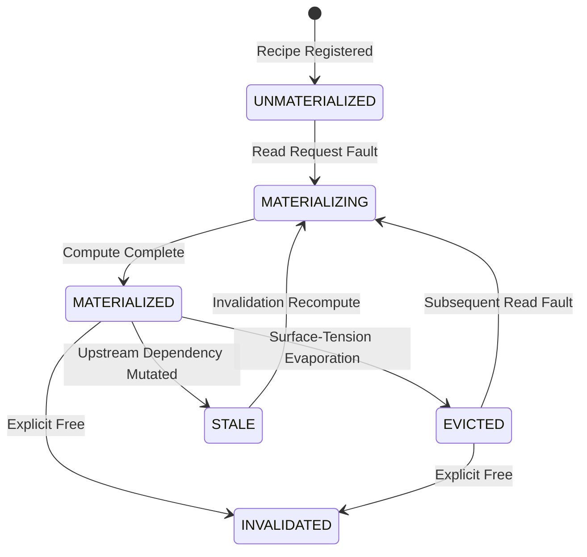

# Causal Materialization Framework (CMF): The Missing Primitive

## 2.1 The Missing Primitive in Operating System Memory Architecture

Modern operating systems treat physical and virtual memory as **passive arrays of bytes**. Under classical virtual memory architectures (Unix, Linux, Windows), if the operating system experiences memory pressure, it has only two options for reclaiming space:
1. **Drop clean file-backed pages** (reloading them from disk block storage via the VFS page cache on demand).
2. **Page out dirty anonymous memory to disk swap** (incurring 10–150 ms storage I/O roundtrip penalties, cache thrashing, and process stalls).

In AdiOS, the **FluidRAM** substrate revolutionized physical allocation by modeling memory as elastic, hydrodynamic computational fluids:
- **Temporal Causal Memory (TCM)** introduced forward-looking execution contracts,
- **Morphic Cellular Memory** embedded micro-operations directly within slab buffers,
- **Chronos Reversible Computing** utilized finite-field Galois $GF(2^{16})$ automorphisms,
- **Surface-Tension Dissipation** dynamically evaporated transient buffer caches.

However, across all existing operating systems—including AdiOS's initial foundation—there remained a **critical architectural gap**:

> **The Foundational Question**:
> *"If a materialized memory object is evaporated under pressure, what authoritative computation recreates it, under what dependencies, with what latency cost, and with what validation?"*

Without answering this question, memory evaporation remains destructive or restricted to disposable scratchpads.

### The Missing Primitive: First-Class Derivations

The **Causal Materialization Framework (CMF)** introduces the missing foundational primitive to the operating system kernel:

$$\mathcal{C} = f(\mathcal{A}, \mathcal{B}, \dots, \theta)$$

Where:
- $\mathcal{C}$ is a **Causal Memory Object** whose physical residency in DRAM is optional and dynamic.
- $\mathcal{A}, \mathcal{B}, \dots$ are explicit upstream causal dependencies (which may themselves be raw root objects or derived causal objects).
- $f$ is an authoritative, registered transformation kernel with declared mathematical purity.
- $\theta$ is an immutable configuration parameter payload.

Crucially, **the derivation recipe is an operating system kernel object, completely independent of the producer process lifetime**. If Process $P_1$ calculates a 3D bounding hierarchy from point-cloud $\mathcal{A}$ and then exits, the kernel preserves the derivation recipe $f(\mathcal{A})$. If Process $P_2$ subsequently requests $\mathcal{C}$, the kernel can re-materialize it on-the-fly, without needing $P_1$ to be alive or serialized to disk.

---

## 2.2 Architectural Contrast & Subsystem Synergy

To understand how CMF fits into AdiOS, we examine its relationship with existing AdiOS components and classical kernel paradigms:

| Subsystem | Primary Responsibility | Relationship to CMF |
| :--- | :--- | :--- |
| **FluidRAM** | Physical & virtual DRAM substrate, hydrodynamic slab pools, surface tension dissipation. | **The Muscle**: FluidRAM manages the physical bytes and allocates/evaporates slabs. CMF is the **Brain** that informs FluidRAM which slabs are safely evaporable and how to recreate them. |
| **TCM (Temporal Causal Memory)** | Predicting thread wakeup horizons and pre-warming working sets prior to scheduling ticks. | **The Scheduler**: TCM answers *when* memory will be needed. CMF answers *how* that memory can be re-derived if it was previously evaporated. |
| **Morphic Cellular Memory** | In-situ computation directly within slab buffers (sum reductions, pattern matching). | **The Execution Engine**: Morphic provides the hardware-friendly micro-kernels that execute derivation recipes inside RAM slabs. |
| **Chronos (Reversible RAM)** | $GF(2^{16})$ finite-field algebraic permutations for zero-information-loss rollbacks. | **The Bidirectional Derivation**: Chronos provides symmetric, bijective derivations where $f^{-1}$ allows instant backward navigation without checkpoint bloat. |
| **Linux Page Cache & Swap** | Evicting LRU pages to swap partitions or re-reading files from disk blocks. | **The Antithesis**: Linux only knows how to re-read bytes from persistent storage. CMF can **recompute** bytes in microseconds, eliminating millisecond disk swap stalls. |
| **Spark / Ray RDDs** | Distributed userland lineage graphs for fault-tolerant data-parallel pipelines. | **The Precedent at Userland vs Kernel**: Spark/Ray implement lineage in JVM/Python userland runtimes. CMF integrates lineage into the **operating system kernel address space and page fault handler**. |

---

## 2.3 Lifecycle State Machine

A Causal Memory Object moves through an explicit, formal state machine within the kernel:

### State Definitions:
1. **`UNMATERIALIZED`**: The derivation recipe is registered with the kernel. Zero physical RAM bytes are committed.
2. **`MATERIALIZING`**: The kernel (or a Morphic in-slab micro-kernel) is currently executing the transform $f$ to produce bytes.
3. **`MATERIALIZED`**: The output bytes reside in physical RAM (or FluidRAM slab). Direct pointer reads execute with zero latency.
4. **`EVICTED`**: Memory pressure caused the kernel to evaporate the physical buffer. The recipe, input references, and telemetry remain intact.
5. **`STALE`**: An upstream input dependency was updated or mutated. Any cached bytes are out of date and must be refreshed.
6. **`INVALIDATED`**: The object has been permanently unlinked and its identifiers recycled.

---

## 2.4 Mathematical Cost-Benefit Formulation

The operating system must dynamically decide whether to **retain** an object in physical memory or **evaporate** it to relieve pressure.

### Rematerialization Cost ($C_{\text{remat}}$)

$$C_{\text{remat}}(\mathcal{C}) = T_{\text{exec}}(f) + \sum_{i \in \text{Inputs}} T_{\text{read}}(i)$$

Where:
- $T_{\text{exec}}(f)$ is the monitored execution time of the derivation transform (tracked via exponential moving average in microseconds).
- $T_{\text{read}}(i)$ is the bus transfer latency required to read input dependency $i$.

### Retention Cost ($C_{\text{retain}}$)

$$C_{\text{retain}}(\mathcal{C}) = \text{Size}(\mathcal{C}) \times \Pi_{\text{pressure}}$$

Where:
- $\text{Size}(\mathcal{C})$ is the physical byte footprint occupied in DRAM.
- $\Pi_{\text{pressure}}$ is the non-linear surface-tension pressure multiplier of the enclosing FluidRAM pool.

### The CMF Eviction Invariant

$$\text{Evict}(\mathcal{C}) \iff C_{\text{remat}}(\mathcal{C}) < \tau_{\text{swap\_stall}} \quad \text{and} \quad \Pi_{\text{pressure}} > \text{Threshold}$$

Under traditional Linux memory management, swapping a 64 KB page cluster to NVMe/HDD requires **$15 – 150 \text{ ms}$** of CPU stall time. In contrast, re-deriving a 64 KB transformed buffer via an in-slab Morphic kernel often takes only **$12 – 45 \ \mu\text{s}$** (a **$1,000\times$ speedup**). 

CMF transforms eviction from a catastrophic I/O penalty into a deterministic, cheap mathematical trade-off.
