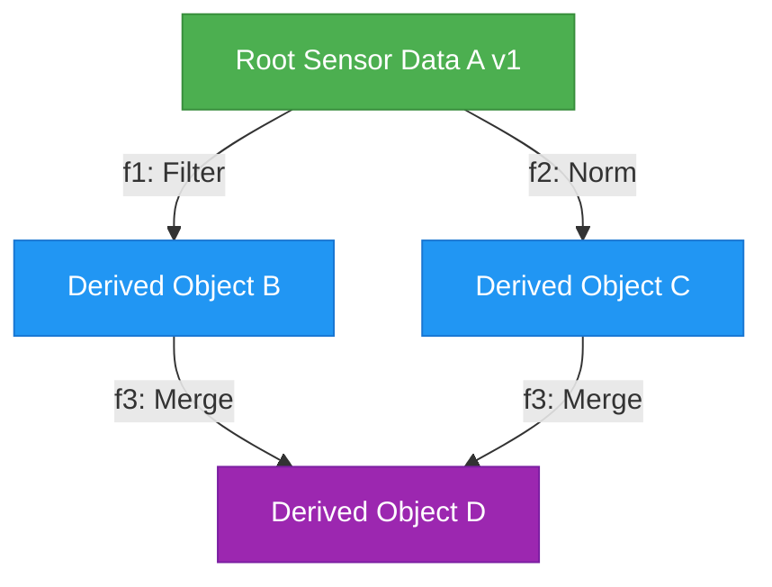

# Causal Object Model (CMF Phase 3)

## 3.1 Semantics of a Causal Memory Object

In classical operating systems, an allocation (`malloc`, `mmap`, `brk`) returns a pointer to an unadorned range of linear bytes. The operating system has no comprehension of:
1. What computational process generated the bytes.
2. What input dependencies the data depends upon.
3. Whether identical bytes or derivations already exist elsewhere in physical RAM.

The **Causal Object Model** formalizes memory allocations as **Causal Objects** managed within the kernel.

### 1. Content-Addressable & Derivation-Hash Identity

Every Causal Object possesses two cryptographic identities:
- **`content_hash`**: The SHA-256 hash of the resident bytes (when materialized).
- **`derivation_hash`**: The deterministic content-addressed hash of the derivation rule:

$$\mathcal{H}_{\text{derivation}} = \text{SHA-256}\left(\text{TransformName} \parallel \text{Sorted}(\text{InputHashes}) \parallel \text{SerializedParams}\right)$$

This allows **Derivation Deduplication**: if two independent processes register identical derivations $[C_1 = f(A, B)]$ and $[C_2 = f(A, B)]$, the kernel recognizes their equivalence, links them to a single causal node, and avoids redundant computation or physical RAM allocation.

### 2. Epochs, Versions, and Invalidation Cascades

When an upstream dependency $\mathcal{A}$ is mutated (e.g. new sensor frame, updated database row):
1. The version of $\mathcal{A}$ increments ($v \leftarrow v + 1$).
2. The kernel's `CausalObjectStore` traverses the reverse-dependency index (`children`).
3. All transitive descendants are automatically marked **`STALE`**, unlinking their physical buffers and ensuring stale data is never served to consumers.

When `Root A` mutates:
$$\text{Mutate}(A) \implies B, C, D \longrightarrow \text{STALE}$$

On subsequent read requests to $D$, the CMF engine automatically schedules re-materialization in topological order.

---

## 3.2 Graph Substrate & Cycle Invariants

The CMF graph substrate enforces strict structural properties:
- **Directed Acyclic Graph (DAG)**: Cycle detection runs during derivation registration. If an object $X$ attempts to depend on an ancestor $Y$ where $Y \in \text{Descendants}(X)$, the registration is rejected with a `ValueError`.
- **Decoupled Process Lifespans**: Causal Objects reside in the kernel object store. If a process terminates (`sys_exit`), its derived causal recipes remain valid in the kernel graph, ready to serve other threads or future jobs.

---

## 3.3 Memory Accounting & Elastic Compression Ratio

The `CausalObjectStore` tracks:
- **$\text{RAM}_{\text{physical}}$**: Physical bytes currently resident in DRAM slabs.
- **$\text{RAM}_{\text{virtual\_causal}}$**: Total bytes represented by all registered causal objects.
- **$\text{Elastic Ratio}$**:

$$\mathcal{R}_{\text{saving}} = \frac{\text{RAM}_{\text{virtual\_causal}}}{\max(1, \text{RAM}_{\text{physical}})}$$

Under heavy memory pressure, non-critical derived objects evaporate to $\text{EVICTED}$, causing physical RAM footprint to drop to near-zero while virtual data availability remains 100% intact through on-demand recomputation.
