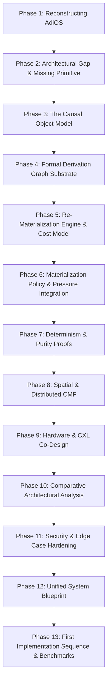

# Causal Materialization Framework (CMF) Architectural Roadmap

## Executive Summary

AdiOS fundamentally reimagined operating system memory management through **FluidRAM**, introducing:
- **Temporal Causal Memory (TCM)** for forward-looking pre-warming contracts,
- **Morphic Cellular Memory** for in-situ computation within slab buffers,
- **Thermodynamic Landauer-Reversible RAM** using finite-field Galois $GF(2^{16})$ automorphisms,
- **Dynamic Surface-Tension Dissipation** for hydrodynamic memory reclaim under pressure.

However, a fundamental architectural question remains unaddressed by conventional virtual memory and current memory substrate models:

> *"If a materialized memory object is discarded or evaporated under pressure, what authoritative computation recreates it, under what dependencies, with what latency cost, and with what validation?"*

The **Causal Materialization Framework (CMF)** is the native operating system primitive answering this question. CMF formalizes memory not as a static array of bytes, but as a directed acyclic graph (DAG) of authoritative derivations:

$$\mathcal{C} = f(\mathcal{A}, \mathcal{B}, \dots)$$

where the derivation rule, input dependencies, deterministic execution environment, re-materialization cost model, and cryptographic validation hashes are managed as **first-class operating system primitives**, surviving the exit or suspension of the producer process.

---

## The 13-Phase Architectural Sequence

The transition to CMF and full systems grounding is executed across 13 rigorous phases, structured as 26 sub-phases and 52 sequential pushes:

### Phase Index & Scope

| Phase | Title | Scope & Architectural Deliverable | Pushes |
| :--- | :--- | :--- | :--- |
| **Phase 1** | **Reconstructing AdiOS** | Reality audit, classification of 14 implemented mechanisms, 10 modeled abstractions, 5 aspirational mechanisms, and 5-tier measurement provenance framework. | 01 – 04 |
| **Phase 2** | **The Architectural Gap** | Formalization of the missing primitive $[C = f(A, B)]$; contrast against TCM, Morphic Memory, Chronos, and Linux page cache. | 05 – 08 |
| **Phase 3** | **The Causal Object Model** | Definition of CMF objects: State, Derivation, Ephemeral Materialization, Identity, and Immutability semantics. | 09 – 12 |
| **Phase 4** | **Derivation Graph Substrate** | Directed Acyclic Graph (DAG) manager, topological ordering, cycle detection, dependency tracking, and invalidation cascades. | 13 – 16 |
| **Phase 5** | **Re-Materialization Engine** | Cost function $Cost = f(Compute, Bandwidth, Latency)$, budget allocator, lazy vs. eager materialization scheduler. | 17 – 20 |
| **Phase 6** | **Policy & Pressure Integration** | Coupling CMF re-materialization with FluidRAM surface tension and hydrodynamic pressure signals. | 21 – 24 |
| **Phase 7** | **Determinism & Purity Proofs** | Sandboxed execution environments, side-effect elimination, cryptographic content verification (SHA-256 / BLAKE3 hashes). | 25 – 28 |
| **Phase 8** | **Spatial & Distributed CMF** | Extending derivations across NUMA nodes, networked nodes, and cluster-wide causal graphs. | 29 – 32 |
| **Phase 9** | **Hardware Co-Design** | Architectural specifications for CXL 3.0 Type-3 memory, near-memory computing, and hardware page-table flags. | 33 – 36 |
| **Phase 10** | **Comparative Analysis** | Mathematical and empirical comparison against Linux VM, Mach microkernel, Unix demand paging, and Spark/Ray RDDs. | 37 – 40 |
| **Phase 11** | **Security & Edge Cases** | Malicious derivation loops, resource exhaustion, poison inputs, untrusted code execution containment. | 41 – 44 |
| **Phase 12** | **Unified System Blueprint** | Full end-to-end specification combining Kernel Core, FluidRAM, Scheduler, MMU, VFS, and CMF. | 45 – 48 |
| **Phase 13** | **First Implementation Sequence** | Executable CMF engine, native C benchmark harness, real physical measurement suite, and empirical verification. | 49 – 52 |

---

## 52-Push Cadence Structure

Each phase contains exactly two sub-phases, and each sub-phase contains exactly two atomic git commits pushed directly to `origin/main`. This ensures incremental review, strict regression prevention (all unit tests must pass before every push), and research-grade scientific provenance.
