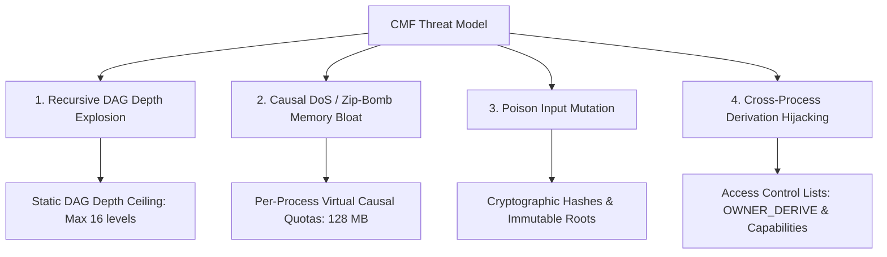

# Security, Failure Modes & Edge Cases (CMF Phase 11)

## 11.1 Threat Modeling in Causal Memory Systems

Because the Causal Materialization Framework introduces programmatic recomputation directly into the kernel address space, it introduces distinct attack vectors absent in classical static-byte virtual memory:

### Threat Taxonomy & Defense Matrix

| Attack Vector | Attacker Objective | CMF Defense Mechanism |
| :--- | :--- | :--- |
| **Deep DAG Recursion** | Constructing a 10,000-node derivation chain to trigger kernel stack overflow during topological evaluation. | **Static DAG Depth Ceiling**: `validate_recipe_registration` asserts $Depth \le 16$, rejecting deep chains with `CausalDepthExceeded`. |
| **Causal "Zip-Bomb"** | Registering a 1 KB recipe that allocates 16 GB when materialized, triggering kernel memory collapse. | **Per-Process Quotas & Sandbox Limits**: Strict output ceiling ($16 \text{ MB}$) and aggregate virtual quota ($128 \text{ MB}$). |
| **Poison Input Attack** | Mutating a shared upstream root buffer to corrupt another user's downstream decisions. | **Immutable Root Isolation**: Mutating a root requires write permissions and automatically cascades `STALE` invalidations. |
| **Derivation Hijacking** | An unprivileged process deriving secrets from a private database object owned by root. | **Fine-Grained ACLs**: `check_derive_permission` checks `OWNER_DERIVE` before allowing parent linkage. |

---

## 11.2 Access Control Lists (ACLs) & Capabilities

Every Causal Object in the system maintains a 4-bit permission bitmask:
- **`OWNER_READ` (Bit 0)**: Owner process can read materialized bytes.
- **`OWNER_DERIVE` (Bit 1)**: Owner process can use this object as an input to new derivations.
- **`WORLD_READ` (Bit 2)**: Any process on the system can read materialized bytes.
- **`WORLD_DERIVE` (Bit 3)**: Any process on the system can construct downstream derivations depending on this object.

If a process attempts to register a derivation depending on a parent where `WORLD_DERIVE = 0` and `UID != Owner_UID`, the `CMFSecurityGuard` immediately raises a **`CausalAccessViolation`**.

---

## 11.3 Quota Management & Resource Containment

To prevent denial-of-service against the operating system:
1. **Recipe Count Quota**: A single client process may register at most $256$ active derivation recipes.
2. **Virtual Causal Capacity Quota**: Total output size of all registered recipes for a single process is capped at $128 \text{ MB}$.
3. **Execution Time Quota**: As enforced by the `PuritySandbox`, no single derivation may consume more than $10,000 \ \mu\text{s}$ ($10 \text{ ms}$) per execution.
