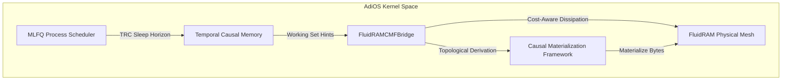

# Subsystem Integration: CMF, FluidRAM, TCM, and Scheduler (CMF Phase 6)

## 6.1 Unifying CMF with the FluidRAM Physical Substrate

In previous stages, AdiOS operated with two powerful but disjoint abstractions:
1. **FluidRAM**: Managed physical DRAM slabs, memory pools, and hydrodynamic surface-tension dissipation without understanding the computational lineage of the bytes.
2. **CMF**: Tracked causal derivation graphs $[C = f(A, B)]$ and cost models without direct ownership of physical hardware buffers.

The **`FluidRAMCMFBridge`** unifies these two pillars into a cohesive operating system memory substrate.



### Bi-directional Slab Binding

When a memory object is allocated or materialized via `allocate_causal_slab()` or `materialize_causal_slab()`:
- A physical slab is reserved in the target FluidRAM pool (`POOL_USER_APPS`, `POOL_STREAM_RING`, etc.).
- The `CausalObject` is linked to the physical `slab_id`.
- The `FluidRAMCMFBridge` records bi-directional mappings:
  $$\text{object\_to\_slab}[\text{obj\_id}] \longleftrightarrow \text{slab\_to\_object}[\text{slab\_id}]$$

---

## 6.2 Intelligent Hydrodynamic Dissipation

Standard operating systems evict pages based strictly on chronological recency (e.g. Linux `mm/vmscan.c` dual-list inactive/active LRU). This causes severe pathological stalls when a cold page that is expensive to re-read from disk is evicted before a recently touched page that could be recomputed in 10 microseconds.

The CMF-FluidRAM integration replaces blind eviction with **Causal Dissipation**:

$$\text{Priority}(\text{Evaporate}) \propto \frac{1}{C_{\text{remat}}(\mathcal{C})} \times \text{Size}(\mathcal{C}) \times \text{Age}(\mathcal{C})$$

1. **Cheapest Recomputations Evaporate First**: Slabs with derivation costs $< 50 \ \mu\text{s}$ are evaporated first to relieve pressure instantly.
2. **Root & Non-Derivable Objects Protected**: Raw ground-truth buffers (sensor inputs, user keystrokes) remain pinned and are never destroyed.
3. **Continuous Pressure Feedback**: Evaporation halts the moment FluidRAM surface tension drops below the target safe zone ($\Pi_{\text{surface\_tension}} < 0.60$).

---

## 6.3 TCM Pre-Warming & Zero-Stall Process Dispatch

When a process executes a sleeping or I/O wait syscall, it emits a Temporal Contract (TRC):
```python
trc = process.emit_trc(wake_horizon=tick + 10, recon_cost_us=35.0)
```

1. **CMF Enqueueing**: The `FluidRAMCMFBridge` extracts the process's `causal_working_set` and registers pre-warming contracts with the `RematerializationScheduler`.
2. **Proactive Materialization**: During the idle ticks before the thread wakes up ($T_{\text{wake}} - 2$), CMF re-derives any evaporated working set slabs into physical FluidRAM memory.
3. **Zero-Stall Dispatch**: When the thread transitions from `SLEEPING` to `RUNNING`, all working set pages are already resident in RAM. The process resumes execution with **0 cold-start page faults and 0 disk swap stalls**.
