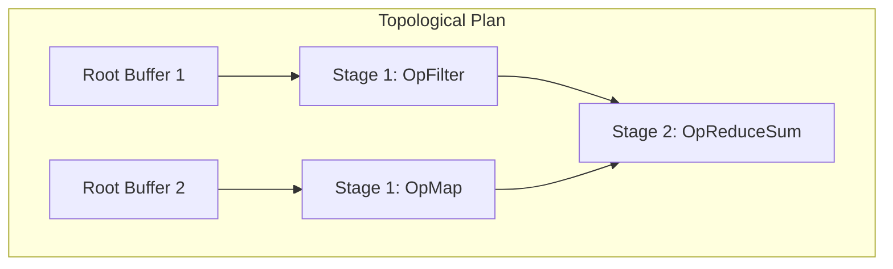

# Derivation Graph Substrate & Pipeline Language (CMF Phase 4)

## 4.1 Composable Derivation Operators & Pipeline Language

The Causal Materialization Framework (CMF) represents computations as explicit, inspectable operator chains rather than opaque, compiled binary blobs. This enables the operating system kernel to:
1. **Analyze mathematical purity** prior to scheduling re-materialization.
2. **Select optimal physical execution targets**: e.g., dispatching an `OpReduceSum` to near-memory Morphic Cellular hardware, or an `OpGaloisPermute` to Chronos reversible arithmetic ALUs.
3. **Generate deterministic content-addressable hashes** of entire transformation pipelines.

### Standard Kernel Operators

| Operator | Mathematical Mapping | Typical System Use Case |
| :--- | :--- | :--- |
| **`OpMap(fn)`** | $y_i = \text{fn}(x_i) \pmod{256}$ | Vector scaling, byte normalization, color space conversion. |
| **`OpFilter(pred)`** | $Y = \{x \in X \mid \text{pred}(x) = \text{True}\}$ | Pattern searching, packet header filtering, event extraction. |
| **`OpReduceSum()`** | $S = \sum_{i=1}^N x_i$ | In-slab cellular reduction without von Neumann bus roundtrips. |
| **`OpGaloisPermute(k)`** | $y_i = x_i \oplus k$ | Reversible Chronos thermodynamic state permutation ($GF(2^8)$). |

### Pipeline Composition & Serialization

Operators can be composed into a **`DerivationPipeline`**:

```python
pipeline = (
    DerivationPipeline("sensor_cleanup")
    .add_op(OpFilter(lambda b: b > 10, "nonzero_filter"))
    .add_op(OpMap(lambda b: b * 2, "gain_boost"))
    .add_op(OpGaloisPermute(key=0xAA))
)
```

The pipeline serializes to a canonical, sorted JSON schema:
```json
{
  "pipeline": "sensor_cleanup",
  "stages": [
    {"op": "FILTER_nonzero_filter", "params": {}},
    {"op": "MAP_gain_boost", "params": {}},
    {"op": "GALOIS_PERMUTE", "params": {"key": 170}}
  ]
}
```
This specification is directly incorporated into the derivation hash, guaranteeing that any two processes declaring identical pipelines map to the exact same causal object.

---

## 4.2 Topological Scheduling & The DAG Execution Engine

When a process requests read access to a non-materialized or evicted object $\mathcal{C}$, the kernel's **`DAGExecutionEngine`** constructs the minimal dependency subgraph and schedules execution:



### Execution Algorithm:
1. **Subgraph Extraction**: Recursively collects all ancestors of the target object.
2. **Topological Sort**: Computes execution order using Kahn's algorithm, asserting acyclicity ($O(V + E)$).
3. **Selective Execution**: Inspects each node's `MaterializationState`. If an intermediate node is already `MATERIALIZED`, it is read directly without recomputation. Only `UNMATERIALIZED`, `EVICTED`, or `STALE` nodes are re-derived.
4. **Telemetry Logging**: Monotonically records:
   - Total plan nodes vs nodes recomputed.
   - Total bytes materialized.
   - End-to-end derivation latency in microseconds ($\mu\text{s}$).

---

## 4.3 Synergy with FluidRAM & TCM

- **FluidRAM Integration**: Each materialized node can be backed by a dedicated `FluidRAMMesh` slab pool (`POOL_USER_APPS`, `POOL_STREAM_RING`).
- **TCM Integration**: When a thread declares a future wakeup horizon via a Temporal Contract (TRC), the `DAGExecutionEngine` can proactively execute the topological plan across idle ticks, guaranteeing zero-stall hot wakeups.
