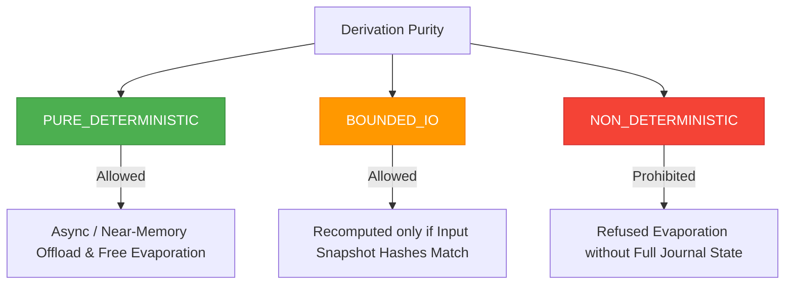

# Determinism, Side-Effect Isolation & Purity Proofs (CMF Phase 7)

## 7.1 The Requirement for Mathematical Purity

Allowing an operating system kernel to autonomously discard and recompute memory introduces a fundamental correctness imperative:

> **The Purity Invariant**:
> *"Re-materialization of an object $\mathcal{C} = f(\mathcal{A}, \mathcal{B})$ must produce the exact bit-for-bit identical payload as the original execution, with zero unmonitored external side-effects."*

If a derivation function $f$ reads from an unversioned hardware clock, generates pseudo-random numbers with non-fixed seeds, or mutates global kernel state, re-deriving $\mathcal{C}$ could introduce catastrophic state drift and silent data corruption.

---

## 7.2 Purity Classification Hierarchy

Every `DerivationRecipe` registered in AdiOS must declare its mathematical purity tier:

1. **`PURE_DETERMINISTIC`**:
   - Strictly functional mapping $Y = f(X)$.
   - No filesystem I/O, no network calls, no system clock reads.
   - Safe for asynchronous background re-materialization, near-memory hardware offload (Morphic cellular PIM), and aggressive evaporation under pressure.
2. **`BOUNDED_IO`**:
   - Reads strictly from immutable, content-addressed block snapshots (e.g. read-only VFS inodes with verified SHA-256 signatures).
   - Recomputation is allowed only after asserting that upstream storage snapshots remain bit-identical.
3. **`NON_DETERMINISTIC`**:
   - Contains unconstrained external side-effects (e.g., polling live hardware sensors, reading `/dev/urandom`).
   - **Kernel Policy**: The kernel **refuses to evaporate** non-deterministic objects without an explicit byte-level snapshot or undo journal.

---

## 7.3 The Purity Sandbox Architecture

The **`PuritySandbox`** executes transformations within an isolated, bounded environment:

- **Time Bounds**: Hard execution timeout ($T_{\text{max}} = 10,000 \ \mu\text{s}$). If a transform exceeds this limit, execution is aborted with a `ResourceBoundExceeded` exception.
- **Memory Bounds**: Hard allocation ceiling ($S_{\text{max}} = 16 \text{ MB}$). Protects against runaway buffer expansion.
- **Cryptographic Verification**: If the recipe specifies a `validation_hash`, the sandbox computes the SHA-256 digest of the output bytes. Any mismatch raises a **`CausalIntegrityViolation`** and quarantines the object.

---

## 7.4 Multi-Trial Replay Verification

Before a newly registered derivation is marked eligible for autonomous evaporation, the kernel can run **Multi-Trial Verification**:
1. Transform $f$ is evaluated across $N=3$ independent iterations using identical input buffers.
2. All three output hashes are compared:
   $$\text{Hash}_1 \equiv \text{Hash}_2 \equiv \text{Hash}_3$$
3. If hashes diverge, the recipe is immediately demoted to `NON_DETERMINISTIC`, preventing unsafe future recomputation.
