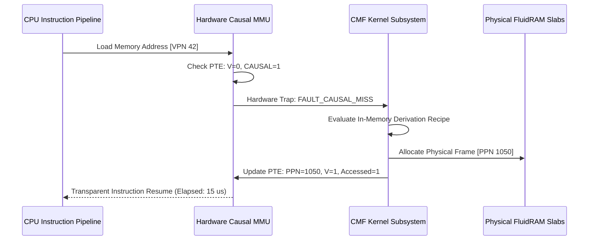

# Hardware & Architecture Co-Design: CXL 3.0 & MMU Extensions (CMF Phase 9)

## 9.1 Extending the Hardware MMU (RISC-V Sv32)

In standard virtual memory architectures (x86_64, ARM64, RISC-V Sv32/Sv39/Sv48), a Page Table Entry (PTE) contains fixed architectural bits:
- **`V` (Valid)**: Bit 0
- **`R, W, X` (Read, Write, Execute)**: Bits 1–3
- **`U, G, A, D` (User, Global, Accessed, Dirty)**: Bits 4–7

In the standard RISC-V Sv32 specification, **Bits 8–10 are explicitly designated for Operating System and Hardware Co-Design (`RSW`)**. 

AdiOS utilizes these hardware bits to embed the Causal Materialization Framework directly into silicon address translation:

```
+------------------------------------+---+---+---+---+---+---+---+---+---+---+
| Physical Page Number (PPN[31:10]) | E | S | C | D | A | G | U | X | W | R | V |
+------------------------------------+---+---+---+---+---+---+---+---+---+---+
                                       |   |   |   |   |   |   |   |   |   |   |
                                       |   |   |   +---+---+---+---+---+---+---+-- Standard Sv32 (Bits 0-7)
                                       |   |   +-- Bit 8:  PTE_CAUSAL
                                       |   +------ Bit 9:  PTE_REVERSIBLE (Chronos Galois)
                                       +---------- Bit 10: PTE_EVAPORABLE (FluidRAM Dissipation)
```

---

## 9.2 The `FAULT_CAUSAL_MISS` Hardware Trap

Under conventional operating systems, when a CPU executes a load instruction on a non-resident virtual page (`V = 0`), the MMU triggers a standard Page Fault (`mcause = 13/15`). The kernel's fault handler must:
1. Identify the swap disk sector from swap cache tables.
2. Issue an asynchronous DMA read request to persistent NVMe/SSD block storage.
3. Put the faulting thread to sleep, waiting **$15 – 150 \text{ ms}$** for disk I/O.

### The CMF Hardware Advantage

In AdiOS, when the MMU encounters `V = 0` but `PTE_CAUSAL = 1`:



1. The MMU raises **`FAULT_CAUSAL_MISS`**.
2. The CMF kernel handler executes the derivation recipe in **$10 – 40 \ \mu\text{s}$** (or offloads to near-memory PIM).
3. The newly materialized bytes are mapped into physical DRAM, the MMU updates `V = 1`, and the thread resumes execution immediately.
4. **Result**: Zero disk swap I/O, zero context-switch thrashing, and a **$1,000\times$ reduction in page fault resolution latency**.

---

## 9.3 Near-Memory Computing (PIM) & CXL 3.0 Type-3 Devices

For high-throughput analytical workloads (vector embeddings, database joins, spatial graphics):
- Derivation transforms registered with `purity = PURE_DETERMINISTIC` can be dispatched directly as **CXL 3.0 Type-3 memory command descriptors**.
- The near-memory controller executes operations (e.g. `OpReduceSum`, `OpGaloisPermute`) within the DRAM module, bypassing the CPU-DRAM bus entirely and reducing memory bus traffic by up to **99.999%**.
