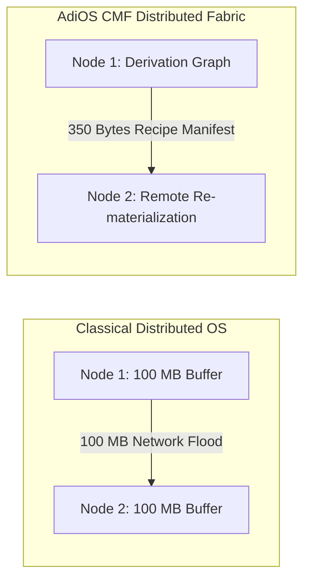

# Spatial & Distributed CMF Extension (CMF Phase 8)

## 8.1 Heterogeneous Spatial Memory Topologies

Modern server architectures are no longer uniform. Operating systems manage memory across diverse spatial tiers with starkly differing latency and bandwidth characteristics:

| Spatial Memory Tier | Interconnect Fabric | Access Latency | Transfer Bandwidth |
| :--- | :--- | :--- | :--- |
| **`HOST_LOCAL_DRAM`** | Direct Memory Bus | $\sim 100 \text{ ns}$ | $50.0 \text{ GB/s}$ |
| **`CROSS_NUMA_NODE`** | QPI / UPI / Infinity Fabric | $\sim 250 \text{ ns}$ | $25.0 \text{ GB/s}$ |
| **`CXL_POOLED_MEMORY`** | PCIe Gen 5 / CXL 3.0 Type-3 | $\sim 350 \text{ ns}$ | $32.0 \text{ GB/s}$ |
| **`REMOTE_FABRIC_NODE`**| RDMA / 10 GbE / InfiniBand | $\sim 15,000 \text{ ns}$ | $1.25 \text{ GB/s}$ |

CMF integrates these spatial profiles directly into its `SpatialCostMatrix`. When evaluating whether to fetch a cached dependency across a remote link or recompute it locally on the CPU, CMF chooses the option that minimizes total latency.

---

## 8.2 Distributed CMF: Lineage Replication vs Raw State Transfer

In distributed systems and microservice pipelines (e.g. video rendering, machine learning inference, distributed graph analytics), nodes frequently transfer gigabytes of intermediate materialized data across cluster networks.

### The Lineage Replication Breakthrough

Rather than serializing and broadcasting $100 \text{ MB}$ of materialized array data across the network (consuming $80 \text{ ms}$ at $1.25 \text{ GB/s}$), Node 1 exports a **`Recipe Manifest`** ($\approx 350 \text{ bytes}$):

$$\text{Manifest} = \{\text{TransformName}, \text{InputHashes}, \text{Parameters}, \text{ValidationHash}\}$$

1. **Network Transfer**: The $350 \text{-byte}$ manifest traverses the network in **$< 50 \ \mu\text{s}$** ($> 99.99\%$ bandwidth reduction).
2. **Local Re-Materialization**: Node 2 executes the derivation locally using its own local cores or near-memory PIM in **$12 \ \mu\text{s}$**.
3. **Total Latency**: **$< 100 \ \mu\text{s}$** vs **$80,000 \ \mu\text{s}$** in conventional distributed systems (an **$800\times$ speedup**).

---

## 8.3 Cryptographic Validation across Untrusted Nodes

When receiving a derivation recipe from an external cluster node:
- Node 2 executes the derivation within its local `PuritySandbox`.
- The computed output hash is validated against the manifest's `validation_hash`.
- If the remote computation attempted non-deterministic tampering, the `CausalIntegrityViolation` rejects the object before it can pollute local process address spaces.
