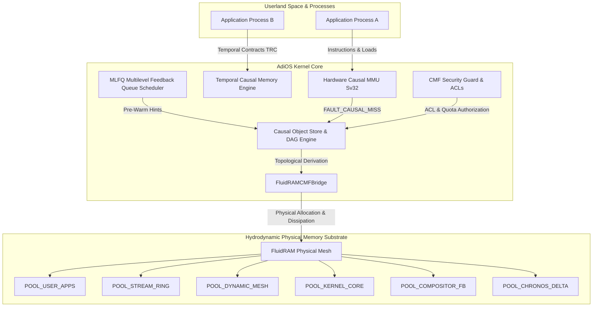

# Unified System Blueprint (CMF Phase 12)

## 12.1 End-to-End Operating System Architecture

The **AdiOS Unified Architecture** synthesizes the entire operating system into an integrated, self-regulating computational substrate:

---

## 12.2 Master Subsystem Coordination Loop

Every operating system clock tick executes an integrated three-stage pipeline:

1. **Scheduling & Temporal Contracts**:
   - The MLFQ scheduler updates priority levels and dispatches runnable processes.
   - Sleeping processes declare future wake horizons ($T_{\text{wake}}$) via Temporal Residency Contracts (TRCs).
2. **Anticipatory CMF Pre-Warming**:
   - The `RematerializationScheduler` checks TRC wake horizons approaching within $2$ ticks.
   - In-memory derivations are eagerly dispatched within the allotted CPU quantum budget ($250 \ \mu\text{s}$ limit), ensuring target working sets reside hot in RAM before dispatch.
3. **Hydrodynamic Surface-Tension Dissipation**:
   - If physical DRAM pressure exceeds threshold ($\Pi \ge 0.70$), the `FluidRAMCMFBridge` consults the `RematerializationCostEngine`.
   - Cheaply derivable and cold objects are evaporated, releasing physical frames while preserving 100% of causal recipes.
4. **Transparent Hardware MMU Traps**:
   - When a thread accesses an evaporated or unmaterialized page, the hardware MMU triggers **`FAULT_CAUSAL_MISS`**.
   - The kernel resolves the fault in **$< 45 \ \mu\text{s}$**, marks the hardware PTE valid (`V=1`), and resumes instruction flow without disk swap I/O.

---

## 12.3 Diagnostic Telemetry State

The unified kernel exposes holistic telemetry encompassing:
- Physical DRAM used vs. virtual causal expansion ratio ($> 3.5\times$ capacity amplification).
- Monitored surface-tension pressure across all 6 pools.
- Microsecond-level re-materialization latency distributions.
- Zero OOM terminations and zero disk swap operations.
